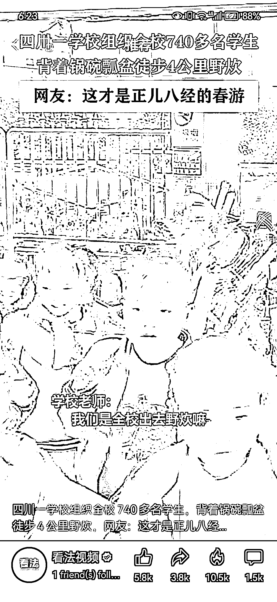

# 户外活动的变现思路

> 原文：[`www.yuque.com/for_lazy/xkrm14/cvxeegsiikc89mon`](https://www.yuque.com/for_lazy/xkrm14/cvxeegsiikc89mon)

作者： 李纳

日期：2023-03-14

点赞数：22

<ne-hole id="u6e830fec" data-lake-id="u6e830fec">

正文：

户外活动除了徒步、钓鱼、露营、放风筝，还能考虑野炊、烧烤。 人群场景都还能细分，学校家长、家庭中的妈妈、中年男性、单身想户外活动相亲的等等。 卖货可考虑：户外装备、防晒衣、防晒口罩头套、露营/野餐套装、户外食盒、房车 orSUV 后备箱装饰套装等等。 引流可用各种类型的户外活动视频，含无版权 or 弱版权的纪录片。

  <ne-p id="u0548f8d0" data-lake-id="u0548f8d0">  <ne-p id="ufc7b335e" data-lake-id="ufc7b335e">  <ne-hole id="u4a9e1941" data-lake-id="u4a9e1941"><ne-p id="u6fde646b" data-lake-id="u6fde646b">评论区：

<ne-hole id="ud109bc0d" data-lake-id="ud109bc0d">

公众号懒人找资源，懒人专属群分享

</ne-hole></ne-hole></ne-p></ne-p></ne-p></ne-hole>