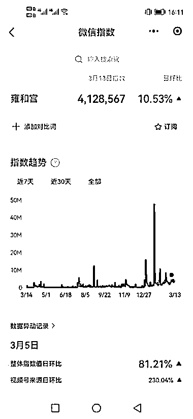
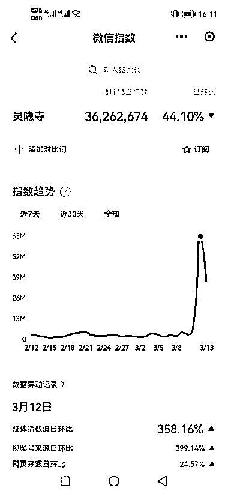
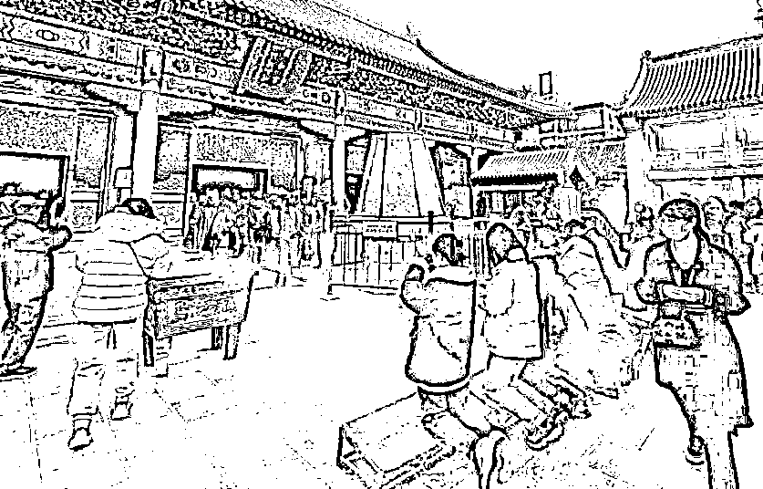

# 越来越多的 90 后和 00 后出游开始选择寺庙游

> 原文：[`www.yuque.com/for_lazy/xkrm14/gw06fzuzaqnneqx3`](https://www.yuque.com/for_lazy/xkrm14/gw06fzuzaqnneqx3)

作者： 抖 sir

日期：2023-03-14

点赞数：22

正文：

随着三年疫情的远去以及天气的变暖，越来越多的 90 后和 00 后出游开始选择寺庙游，以雍和宫和灵隐寺为例，以下是近期的微信指数以及抖音指数，小红书搜索雍和宫也有 11 万+的笔记展现量，而寺庙游的爆火，带火了各种所谓的开光饰品，雍和宫的网红“香灰手串”，灵隐寺的十八籽串，而雍和宫手串爆红的同时，由此也衍生出了跑腿代购的业务，相关服务在各大电商、短视频平台比比皆是。正所谓宇宙的尽头是玄学，玄学赛道比如星座，命理，风水，塔罗牌等等衍生出的小众产品依旧大有可为！

  

  

  

  

  

评论区：

公众号懒人找资源，懒人专属群分享

</ne-p></ne-p></ne-p></ne-p></ne-p>