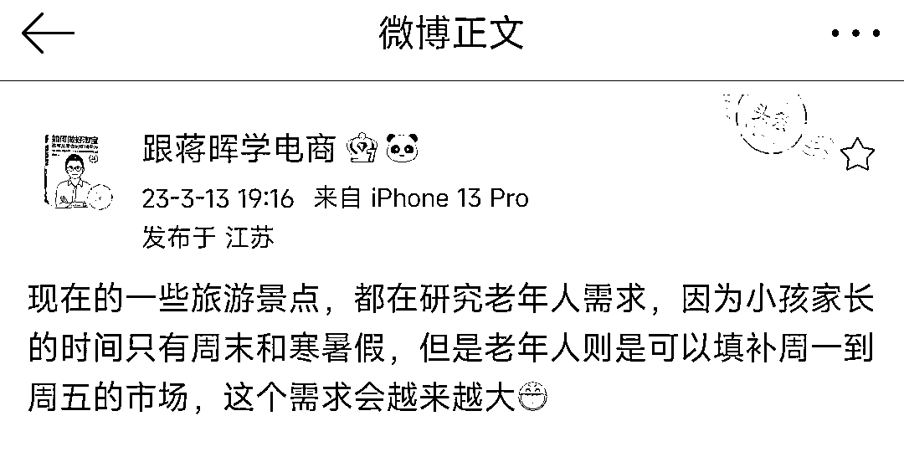

# 认知：各种资源逐渐向老年人倾斜

> 原文：[`www.yuque.com/for_lazy/xkrm14/spu1emb7dg0ivmvn`](https://www.yuque.com/for_lazy/xkrm14/spu1emb7dg0ivmvn)

作者： 苏锦年

日期：2023-03-13

点赞数：47

<ne-hole id="u8aad22e0" data-lake-id="u8aad22e0"><ne-card data-card-name="hr" data-card-type="block" id="vyERL" data-event-boundary="card">

正文：

除了旅游，应该还有其他的也会逐渐向老年人倾斜 比如社交方面，娱乐休闲方面

<ne-card data-card-name="image" data-card-type="inline" id="g52Dc" data-event-boundary="card">  <ne-hole id="ub68b910c" data-lake-id="ub68b910c"><ne-card data-card-name="hr" data-card-type="block" id="X4GAB" data-event-boundary="card"><ne-p id="ubac21687" data-lake-id="ubac21687">评论区：

潮州痞子蔡 : 看看能否抓到具体的点，以前会有老人短期游，也会违法的针对老人做理财、保健品分销等，这个既关注生意，也关爱自家老人，避免被骗

<ne-hole id="ue91385b6" data-lake-id="ue91385b6"><ne-card data-card-name="hr" data-card-type="block" id="mGBzB" data-event-boundary="card">

公众号懒人找资源，懒人专属群分享

</ne-card></ne-hole></ne-card></ne-hole></ne-card></ne-p></ne-card></ne-hole>