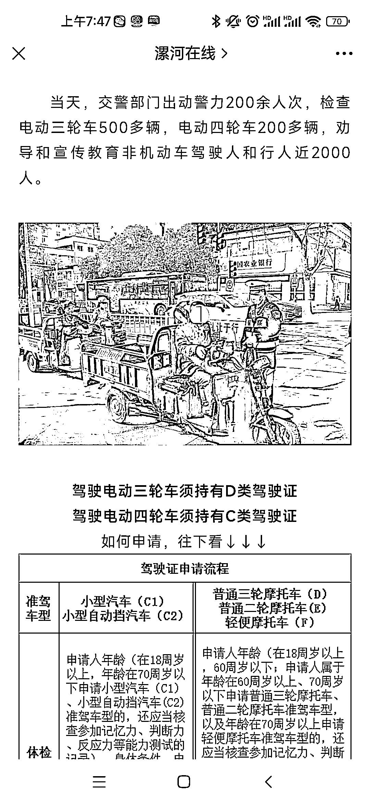

# 思路：电动车需要上牌照，吸引优质的同城流量

> 原文：[`www.yuque.com/for_lazy/xkrm14/ccm6kr3zkr8obrph`](https://www.yuque.com/for_lazy/xkrm14/ccm6kr3zkr8obrph)

作者： 勿以恶小而为之

日期：2023-03-13

点赞数：11

正文：

本地最新的政策，电动车，电动三轮车需要上牌照，需要持有 D F 驾驶证。 表面上是利好驾校。 我看到这个消息第一眼就是可以用这个信息来引流了，抖音小红书都可以。非常优质的同城流量，最少可以做一个月，从信息发布，到考证增驾步骤，到驾校选择，到驾校的分销，沉淀下来社区团购或者接入自己的业务体系就行了。太舒服了

  

评论区：

公众号懒人找资源，懒人专属群分享

</ne-p>