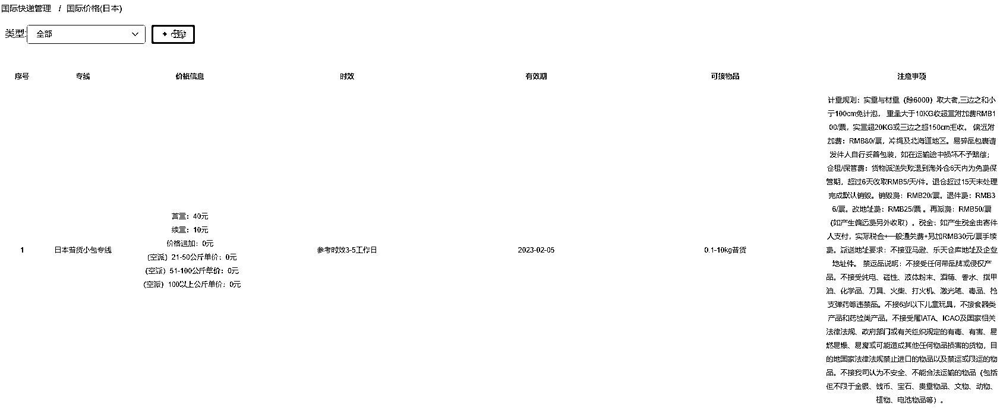
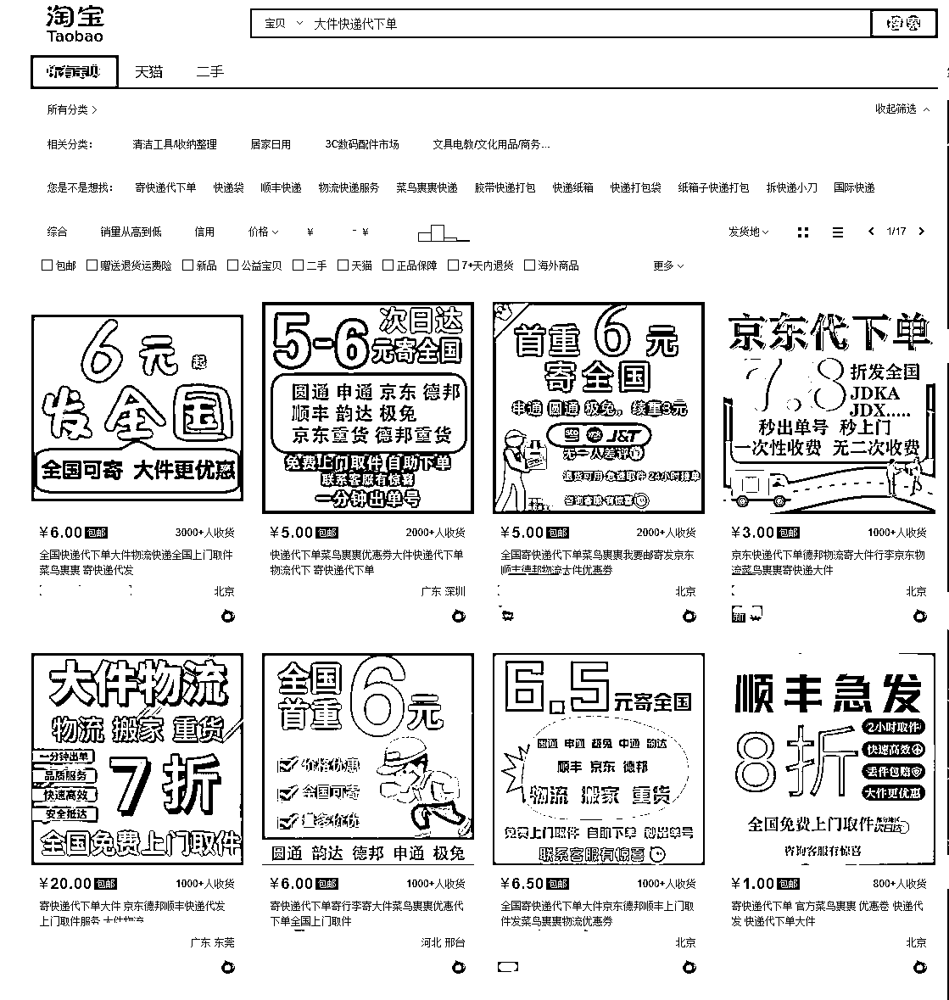

# 快递代下系统，有海外业务

> 原文：[`www.yuque.com/for_lazy/xkrm14/wz2il5all0ugyxyw`](https://www.yuque.com/for_lazy/xkrm14/wz2il5all0ugyxyw)

<ne-text id="u11ffe275">作者： 小怪兽</ne-text>

<ne-text id="u000886b6">日期：2023-03-13</ne-text>

<ne-text id="ud48f223f">点赞数：</ne-text><ne-text id="ud7ddbe20" ne-bold="true">10</ne-text>

<ne-hole id="ud8b5a816" data-lake-id="ud8b5a816"><ne-card data-card-name="hr" data-card-type="block" id="u3Wzd" data-event-boundary="card">

<ne-text id="u44df3895">正文：</ne-text>

<ne-text id="u45651c5e">海外快递代下 前几天看到有大佬发了一条快递 cps 之美国版 想起最近自己用的快递代下系统出现了海外业务模块</ne-text> <ne-text id="u36ed9221">1、如何寄快递到国外用什么（之前朋友问我，怎么寄件去香港） 2、寄件的时候需要注意哪些事项（违禁品，如何打包） 3、寄件费用如何算 4、寄件时效 等</ne-text> <ne-text id="u6b903164">针对以上几个问题做一些关联性的服务，就如同现在国内的快递代下， 普通的小件是引流品，而重货才是赚钱的 针对海外快递做服务增值收费</ne-text>

<ne-card data-card-name="image" data-card-type="inline" id="yXGsB" data-event-boundary="card"></ne-card>

<ne-card data-card-name="image" data-card-type="inline" id="Xgp47" data-event-boundary="card"></ne-card>

<ne-card data-card-name="image" data-card-type="inline" id="wSS2w" data-event-boundary="card"></ne-card>

<ne-hole id="u9c5e162f" data-lake-id="u9c5e162f"><ne-card data-card-name="hr" data-card-type="block" id="b9Gyo" data-event-boundary="card">

<ne-text id="ube9189e9">评论区：</ne-text>

<ne-hole id="u0fbadccd" data-lake-id="u0fbadccd"><ne-card data-card-name="hr" data-card-type="block" id="uND0l" data-event-boundary="card">

<ne-text id="ub07f7840">公众号懒人找资源，懒人专属群分享</ne-text>

</ne-card></ne-hole></ne-card></ne-hole></ne-card></ne-hole>