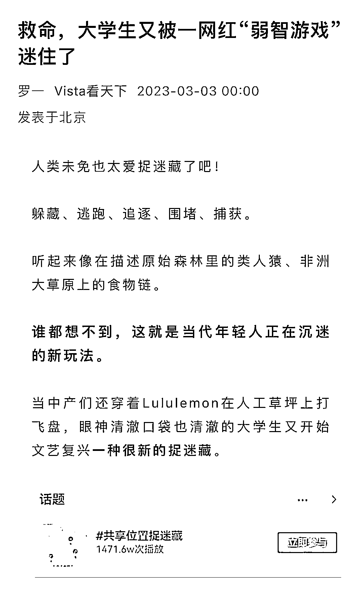

# 异常值：共享位置捉迷藏，引流大学生

> 原文：[`www.yuque.com/for_lazy/xkrm14/xkwcrvdxq10x5i43`](https://www.yuque.com/for_lazy/xkrm14/xkwcrvdxq10x5i43)

作者： 好六

日期：2023-03-13

点赞数：10

正文：

共享位置捉迷藏在大学生群体特别火，接下来会延伸到全学龄阶段，最初级玩法：提供攻略、推荐同城捉迷藏地点，获取流量卖资料、卖徽章、卖课程，高阶玩法：组织同城高校、中学、小学对战，引流卖课、卖安全装备、提供服装，卖定位手表，妥妥的大生意。一件小事跟一件大事做起来是一样的，那为什么不直接把小事往大了做呢？

评论区：

阿黎 : 结合高校大学生的资源置换，大学生 CP 配对也很香

好六 : 对，可以扩展很多项目，已经看到有人在组织线下活动了

公众号懒人找资源，懒人专属群分享

