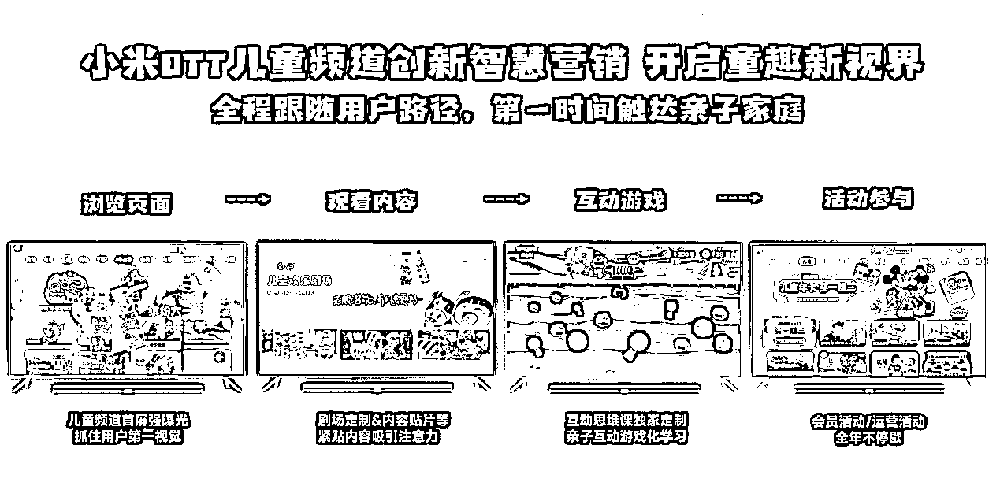
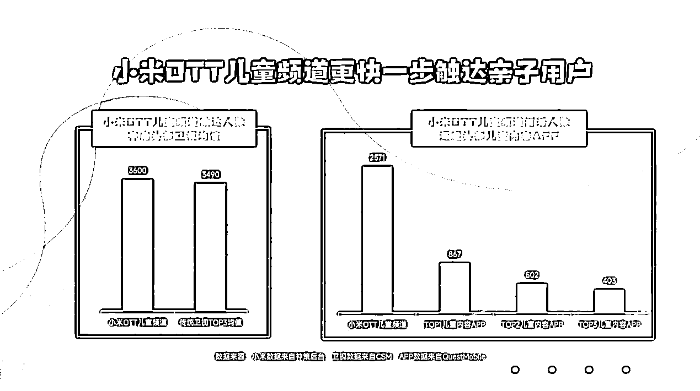

# 大屏营销正“狂飙”，激活万亿婴童市场新增量

> 原文：[`www.yuque.com/for_lazy/xkrm14/fiswfcm4ot4y1h37`](https://www.yuque.com/for_lazy/xkrm14/fiswfcm4ot4y1h37)

作者： 少儿探索科学实验室

日期：2023-03-13

点赞数：6

<ne-hole id="u1f62a9c5" data-lake-id="u1f62a9c5"><ne-card data-card-name="hr" data-card-type="block" id="zV20L" data-event-boundary="card">

正文：

大屏营销正“狂飙”，激活万亿婴童市场新增量 数据显示，从 2020 年到 2022 年，相比移动端网络视频平台，消费者使用 OTT 观看内容的倾向度中，少儿节目增长 54%，增速远超电视剧、综艺、电影等热门内容。

<ne-card data-card-name="image" data-card-type="inline" id="FVBOW" data-event-boundary="card"></ne-card>

<ne-card data-card-name="image" data-card-type="inline" id="TTVQ0" data-event-boundary="card"></ne-card>

<ne-card data-card-name="image" data-card-type="inline" id="xfDnz" data-event-boundary="card"></ne-card>

<ne-hole id="udbb6d546" data-lake-id="udbb6d546"><ne-card data-card-name="hr" data-card-type="block" id="f8bdd" data-event-boundary="card">

评论区：

<ne-hole id="uba93835e" data-lake-id="uba93835e"><ne-card data-card-name="hr" data-card-type="block" id="b2Jmu" data-event-boundary="card">

公众号懒人找资源，懒人专属群分享

</ne-card></ne-hole></ne-card></ne-hole></ne-card></ne-hole>