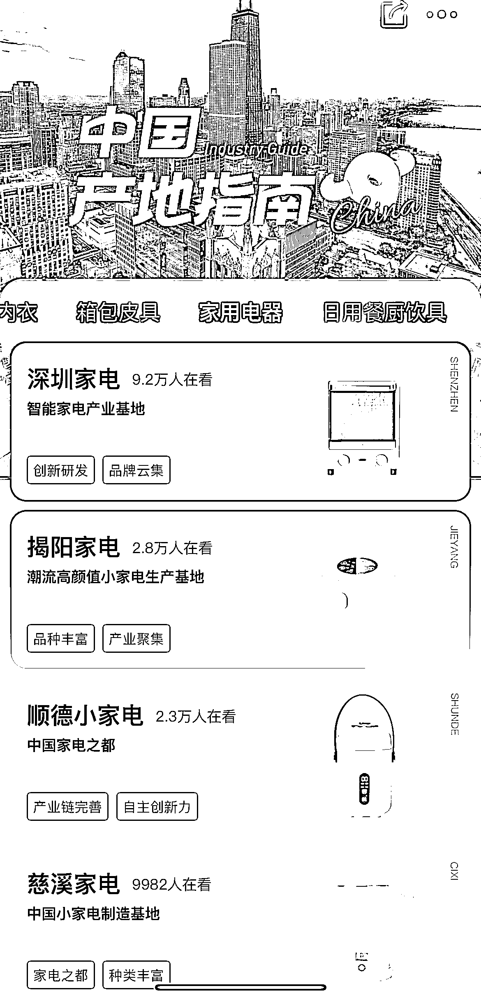
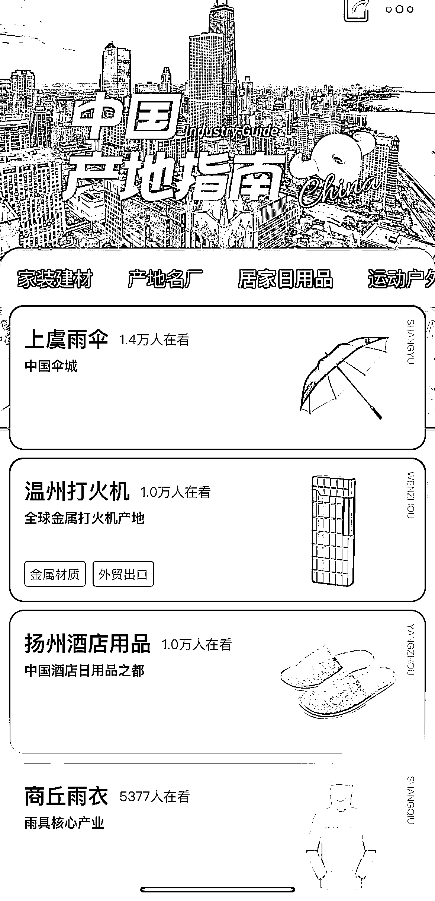

# 可根据阿里巴巴线下产业带数据，跑线下市场

> 原文：[`www.yuque.com/for_lazy/xkrm14/bvqbuy9e1qpykogd`](https://www.yuque.com/for_lazy/xkrm14/bvqbuy9e1qpykogd)

作者： Jane

日期：2023-03-17

点赞数：56

<ne-hole id="uce0fc9d1" data-lake-id="uce0fc9d1">

正文：

阿里巴巴有个产业带，跑跑线下市场，品类更加丰富集中，或许有不一样的收获

  <ne-p id="u6f2f095c" data-lake-id="u6f2f095c">  <ne-p id="ua9b69db2" data-lake-id="ua9b69db2">  <ne-p id="ud572086d" data-lake-id="ud572086d">  <ne-hole id="u75fa3625" data-lake-id="u75fa3625"><ne-p id="u5aacc22c" data-lake-id="u5aacc22c">评论区：

暂无评论

<ne-hole id="ue5902bc5" data-lake-id="ue5902bc5">

公众号懒人找资源，懒人专属群分享

</ne-hole></ne-hole></ne-p></ne-p></ne-p></ne-p></ne-hole>