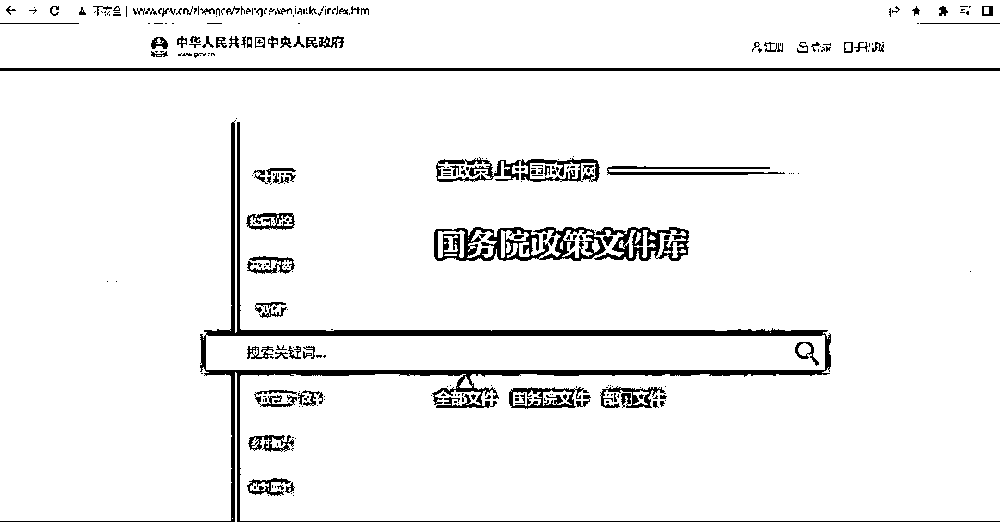

# 网站推荐：政策文件库

> 原文：[`www.yuque.com/for_lazy/xkrm14/mtzngrtgivtaw30t`](https://www.yuque.com/for_lazy/xkrm14/mtzngrtgivtaw30t)

<ne-p id="udfe64bd3" data-lake-id="udfe64bd3"><ne-text id="u8bb15841">作者： Gao</ne-text></ne-p> <ne-p id="ua7488083" data-lake-id="ua7488083"><ne-text id="uad05a464">日期：2023-03-17</ne-text></ne-p> <ne-p id="u28da20d6" data-lake-id="u28da20d6"><ne-text id="u18edc50b">点赞数：</ne-text><ne-text id="u73e52efa" ne-bold="true">33</ne-text></ne-p> <ne-hole id="u8bfceab4" data-lake-id="u8bfceab4"><ne-card data-card-name="hr" data-card-type="block" id="NJygZ" data-event-boundary="card"><ne-p id="u742f964b" data-lake-id="u742f964b"><ne-text id="uab3e5bd9">正文：</ne-text></ne-p> <ne-p id="u51a8a8d4" data-lake-id="u51a8a8d4"><ne-text id="u63eaef73">推荐一个网站，特别是刚结束了两会，好多文件值得研究下，这里是真正的官方文件</ne-text></ne-p> <ne-p id="u97572b2b" data-lake-id="u97572b2b"><ne-card data-card-name="image" data-card-type="inline" id="rnYz7" data-event-boundary="card">  <ne-hole id="uc450e23e" data-lake-id="uc450e23e"><ne-card data-card-name="hr" data-card-type="block" id="ZCint" data-event-boundary="card"><ne-p id="uefaab518" data-lake-id="uefaab518"><ne-text id="u99033510">评论区：</ne-text></ne-p> <ne-p id="u2e8a427b" data-lake-id="u2e8a427b"><ne-text id="ua2b8a1b4">三个问号 : 应该放个链接，方便圈友[捂脸]</ne-text></ne-p> <ne-p id="u716961f6" data-lake-id="u716961f6"><ne-text id="u03c102a9">Gao : 怕被吞，而且这个应该很容易搜索到了</ne-text></ne-p> <ne-hole id="u0216258e" data-lake-id="u0216258e"><ne-card data-card-name="hr" data-card-type="block" id="JqP4e" data-event-boundary="card"><ne-p id="ub30114e2" data-lake-id="ub30114e2"><ne-text id="uaac0e28a">公众号懒人找资源，懒人专属群分享</ne-text></ne-p></ne-card></ne-hole></ne-card></ne-hole></ne-card></ne-p></ne-card></ne-hole>