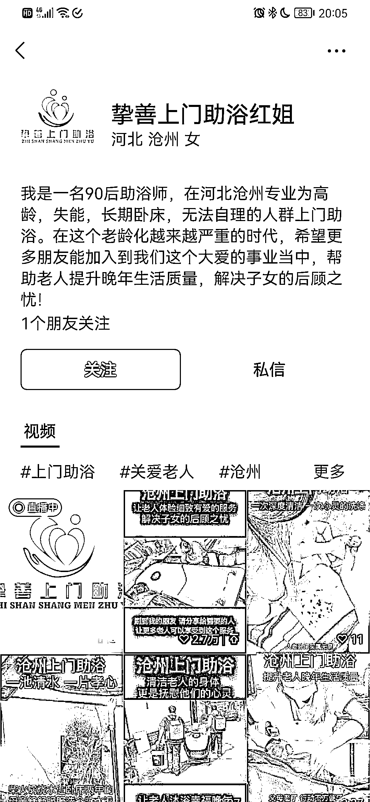

# 视频号做老年人上门服务，市场大

> 原文：[`www.yuque.com/for_lazy/xkrm14/bdfbqioebw4uwpbq`](https://www.yuque.com/for_lazy/xkrm14/bdfbqioebw4uwpbq)

<ne-text id="u56f456a3">作者： 陈龙</ne-text>

<ne-text id="ue9b54bcc">日期：2023-03-13</ne-text>

<ne-text id="u71dded29">点赞数：</ne-text><ne-text id="u33198eef" ne-bold="true">39</ne-text>

<ne-hole id="ud788c27f" data-lake-id="ud788c27f"><ne-card data-card-name="hr" data-card-type="block" id="EpUXH" data-event-boundary="card">

<ne-text id="u993641c6">正文：</ne-text>

<ne-text id="ufd98a7bf">上门给老人洗澡，护理一条龙服务，只要 298 老年人群体特别多，但是能细致照顾老人的太少，一般的养老院（3000 左右一个月）的也做不到这么细致的程度</ne-text> <ne-text id="ueeb2ac7c">有需求，就是有市场 而且还可以在 298 的基础服务上增加其他的收费项目，采耳推拿，还可以推销大健康产品</ne-text> <ne-text id="uf6ab9add">后续还可以把老人的子女沉淀到微信上，后续还可以多次复购和其他的变现</ne-text>

<ne-card data-card-name="image" data-card-type="inline" id="gjQmS" data-event-boundary="card">  <ne-p id="u790a694c" data-lake-id="u790a694c"><ne-card data-card-name="image" data-card-type="inline" id="XWwSZ" data-event-boundary="card">  <ne-hole id="u97d9c6a8" data-lake-id="u97d9c6a8"><ne-card data-card-name="hr" data-card-type="block" id="jHtMp" data-event-boundary="card"><ne-p id="ue63a1c3c" data-lake-id="ue63a1c3c"><ne-text id="u94c300d3">评论区：</ne-text>

<ne-text id="u8ed6bcdc">麻雀 : 上门洗浴服务是指为可能难以使用传统洗浴设施的老年人提供居家洗浴服务。这些服务可以帮助促进老年人口的卫生、独立和整体福祉。下面，我们将讨论实现和扩展老年人上门洗浴服务的好处、挑战和潜在解决方案。</ne-text> <ne-text id="uf1fda3e1">上门洗浴服务的好处： 上门洗澡服务可以为老年人提供许多好处，包括： 改善卫生和清洁 提高独立性和自主性 降低跌倒和受伤的风险 提高生活质量</ne-text> <ne-text id="u45d4083a">增加社会化和社区参与 实施和扩展的挑战和障碍： 虽然上门洗浴服务有很多好处，但其实施和扩展也存在一些挑战和障碍，包括： 资金和资源有限 缺乏训练有素的人员</ne-text> <ne-text id="uaee8396d">到达偏远地区的后勤挑战 来自老年人或其护理人员的抵制 缺乏对服务好处的认识和教育 当前模型和成功示例概述：</ne-text> <ne-text id="ucdd6421d">一些国家已经成功地为老年人提供了上门洗浴服务。例如，在日本，地方政府建立了沐浴巴士服务，前往各个社区，为老年人提供沐浴服务。在新加坡，政府实施了一项“沐浴无国界”计划，为无法离开家的老年人提供居家沐浴服务。在美国，一些家庭保健机构提供洗浴服务作为其家庭保健服务的一部分。</ne-text> <ne-text id="ua10fe7cf">克服挑战和障碍的潜在解决方案： 为了克服实施和扩大上门沐浴服务的挑战和障碍，可以考虑几种潜在的解决方案，包括：</ne-text> <ne-text id="u0023e765">创新的筹资模式，如公私伙伴关系或基于社区的资助举措 与社区组织和志愿者建立伙伴关系，帮助提供服务 利用技术和远程医疗促进服务提供并减少对人员的需求</ne-text> <ne-text id="u57876bec">针对老年人及其照顾者的教育和提高认识运动，以提高对服务的接受程度 对政策制定者、医疗保健提供者和社区组织的建议：</ne-text> <ne-text id="ucb2913e4">为了优先考虑和投资老年人的上门洗浴服务，政策制定者、医疗保健提供者和社区组织应考虑以下建议： 制定支持提供这些服务的政策和法规</ne-text> <ne-text id="u839625d9">投资于劳动力发展计划，以培训人员并提高能力 探索创新资助模式以支持服务提供 与社区组织和志愿者合作，帮助提供服务</ne-text> <ne-text id="uf3b8450d">教育老年人及其护理人员了解该服务的好处以及如何获得服务 监控和评估服务提供，以确保质量和可持续性。</ne-text>

<ne-text id="u8d2be8a6">陈龙 : 谢谢</ne-text>

<ne-text id="uf5827cf4">潮州痞子蔡 : 这种应该是低频吧，不知多久一次服务？</ne-text>

<ne-text id="u64b4f078">水哥爱搞钱 : 前几天深圳卫健委也发了一个公益上门洗澡的，下面好多人评论愿意付费，我也发一波风向标</ne-text>

<ne-text id="u48c3b0e6">陈龙 : 嗯嗯</ne-text>

<ne-text id="ubdb85519">小尾巴 : 年纪越大频率应该会越高，我记得好像有相关文章研究过</ne-text>

<ne-hole id="uf13300ee" data-lake-id="uf13300ee"><ne-card data-card-name="hr" data-card-type="block" id="LcfMu" data-event-boundary="card">

<ne-text id="u66491380">公众号懒人找资源，懒人专属群分享</ne-text>

</ne-card></ne-hole></ne-card></ne-hole></ne-card></ne-p></ne-card></ne-p></ne-card></ne-hole>