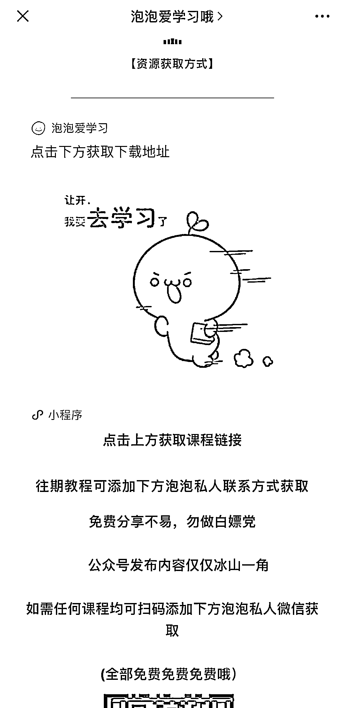

# 公众号发布网赚、副业等资料引流，及变现操作思路

> 原文：[`www.yuque.com/for_lazy/xkrm14/dufq75cbhpbwgsym`](https://www.yuque.com/for_lazy/xkrm14/dufq75cbhpbwgsym)

<ne-text id="u42c63e9e">作者： 振哥</ne-text>

<ne-text id="u61822e70">日期：2023-03-17</ne-text>

<ne-text id="ub7b501f7">点赞数：</ne-text><ne-text id="ua3342304" ne-bold="true">36</ne-text>

<ne-hole id="u62090181" data-lake-id="u62090181"><ne-card data-card-name="hr" data-card-type="block" id="I76xL" data-event-boundary="card">

<ne-text id="uf381ff41">正文：</ne-text>

<ne-text id="u2ce141dc">公众号发布网赚、副业等资料信息引流，引导用户下载。</ne-text> <ne-text id="u2d89f413">用户下载需要在小程序看广告（小程序流量主），资料链接是夸克网盘链接（网盘拉新），还可以引到私域（副业粉、cps 粉），以及付费加群，一鱼多吃。</ne-text> <ne-text id="u3d35d772">这种通过搜索进来的流量比较精准，至少能实现上面提到的 2-3 处变现点。</ne-text>

<ne-card data-card-name="image" data-card-type="inline" id="u18Yu" data-event-boundary="card">  <ne-p id="u19bf42c2" data-lake-id="u19bf42c2"><ne-card data-card-name="image" data-card-type="inline" id="J4KYX" data-event-boundary="card">  <ne-p id="u1678da8e" data-lake-id="u1678da8e"><ne-card data-card-name="image" data-card-type="inline" id="pEHch" data-event-boundary="card">  <ne-p id="u382206aa" data-lake-id="u382206aa"><ne-card data-card-name="image" data-card-type="inline" id="iPqT6" data-event-boundary="card">  <ne-hole id="u9a9e88f5" data-lake-id="u9a9e88f5"><ne-card data-card-name="hr" data-card-type="block" id="wXJSb" data-event-boundary="card"><ne-p id="u8528e804" data-lake-id="u8528e804"><ne-text id="u7c416757">评论区：</ne-text>

<ne-text id="u410513c4">皇冠一刻钟 : 这好像是有老师的 教他们这么玩 统一抖音小红书引流到公众号</ne-text>

<ne-hole id="uddfafab8" data-lake-id="uddfafab8"><ne-card data-card-name="hr" data-card-type="block" id="vNwSG" data-event-boundary="card">

<ne-text id="u492407b0">公众号懒人找资源，懒人专属群分享</ne-text>

</ne-card></ne-hole></ne-card></ne-hole></ne-card></ne-p></ne-card></ne-p></ne-card></ne-p></ne-card></ne-p></ne-card></ne-hole>