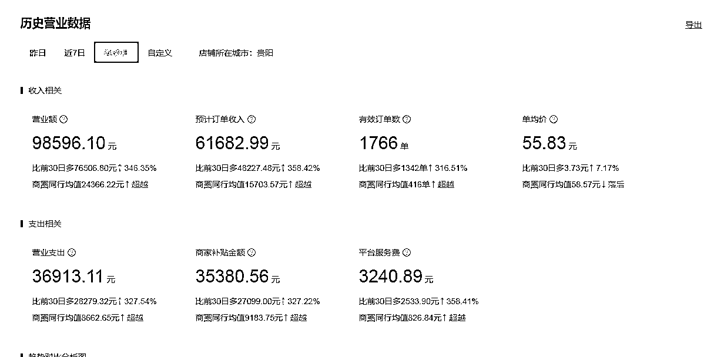
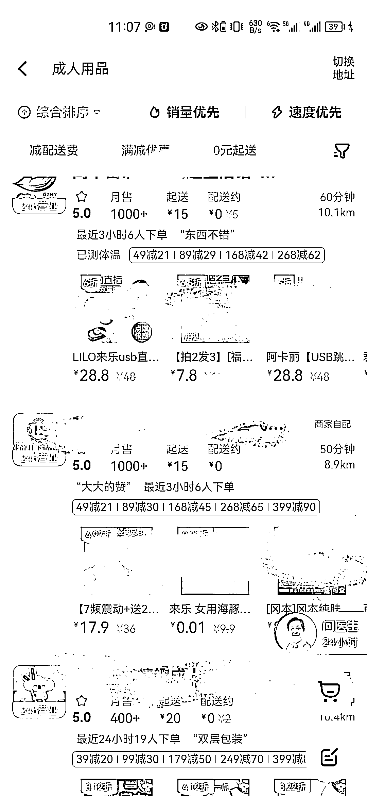

# 成人用品外卖项目，销售数据好

> 原文：[`www.yuque.com/for_lazy/xkrm14/spkqpriebb5t2qvb`](https://www.yuque.com/for_lazy/xkrm14/spkqpriebb5t2qvb)

作者： 莫村长

日期：2023-03-16

点赞数：56

<ne-hole id="u11bddb85" data-lake-id="u11bddb85">

正文：

成人用品外卖 短视频上看到了一个介绍成人用品外卖的生意，这个生意有需求量大，转化高，竞争小的特点。另外外卖隐蔽发货确实解决一些后顾之忧。 所以进行了一些市场分析和资料搜索 从项目回报率的情况来看，以贵阳店为例，场地成本 3000 元/月，2 个全职的人员，一人按照市场薪资 4000 元/月计算，按照近 30 天的营业额 6 万元来计算，扣除跑腿费用和运营服务费 9000 元，产品的成本在 1.5 万元，净利润约为 2.5 万元，这个项目的回报率是相当可观的。 然后搜了下小区周边的外卖，做的家数不多，闷声发大财了属于是

  <ne-p id="u01c80494" data-lake-id="u01c80494">  <ne-hole id="u55ccb355" data-lake-id="u55ccb355"><ne-p id="u2341dca3" data-lake-id="u2341dca3">评论区：

MYX(爆单路上) : 老哥，你贴图的数据也是短视频上的？

莫村长 : 网上找到的资料

黄晓斌 : 哪个视频号圈友能分享下吗，感谢感谢

冬日暖阳 : 怎么做呢

乐希 : 之前在北京考虑做，但是很卷[囧]周边 5 公里内竞争，地段选择和周边人群需求非常重要

莫村长 : 飞翔网络创业 99 最新一期视频号

美霞 : 有个朋友开了个 24 小时自助店，利润很可观。这个开店选址很重要。

<ne-hole id="ub76e4b36" data-lake-id="ub76e4b36">

公众号懒人找资源，懒人专属群分享

</ne-hole></ne-hole></ne-p></ne-p></ne-hole>