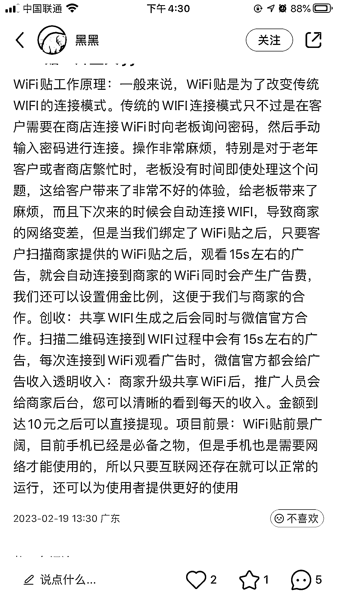

# 线下引流，共享 Wifi 贴项目

> 原文：[`www.yuque.com/for_lazy/xkrm14/tkial8kc5h8xg86g`](https://www.yuque.com/for_lazy/xkrm14/tkial8kc5h8xg86g)

作者： 雨辰

日期：2023-03-16

点赞数：48

正文：

共享 wifi 贴 沟通商家在店里贴上共享 wifi 贴，进店客户可以直接扫码连上店里 wifi，不用一次又一次问店里的 wifi 密码。 变现方式：客户连上 wifi 前会观看 15s 广告，推广得佣金。 细水长流，有的单独一家店的客流量就很多，多合作一些店铺，利润很可观。 之前做地推的圈友可以搞起来了

  

  

评论区：

幻想家☁️ : 这个好猛，但是 15 秒会不会有点长？

雨辰 : 想连 wifi 的人不会觉得长，因为他自己扫码了

明月几时有 : 我做过，商家和物料都容易搞定，容易被上家对接 wifi 的骗，大家对接上家的时候一定要注意

王富贵 G 丶 : 兄弟加个 V 请教下

秀强 : 圈友可以加个 v 么

秀强 : 可以加个 V 学习下么

雨辰 : 你好，我是在小红书看到的，自己不做这方面。可以去小红书看看，但是要注意上家是否靠谱，这个需要筛选

公众号懒人找资源，懒人专属群分享

</ne-p></ne-p>