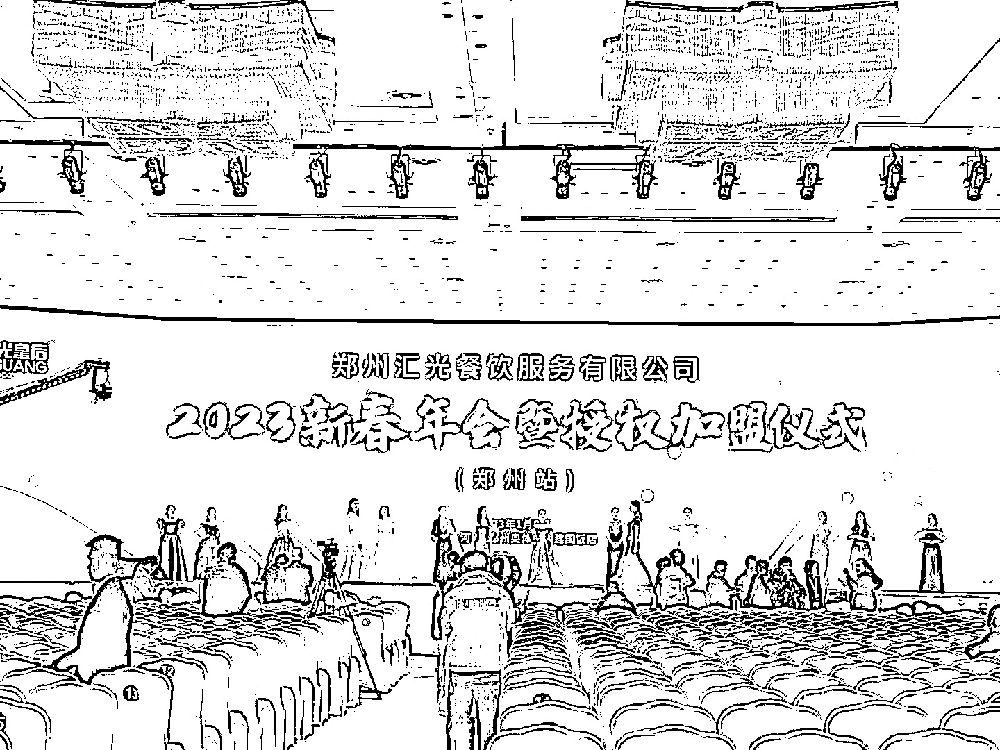
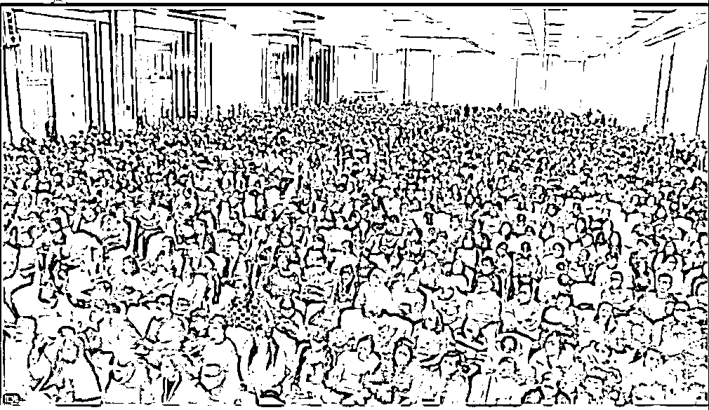
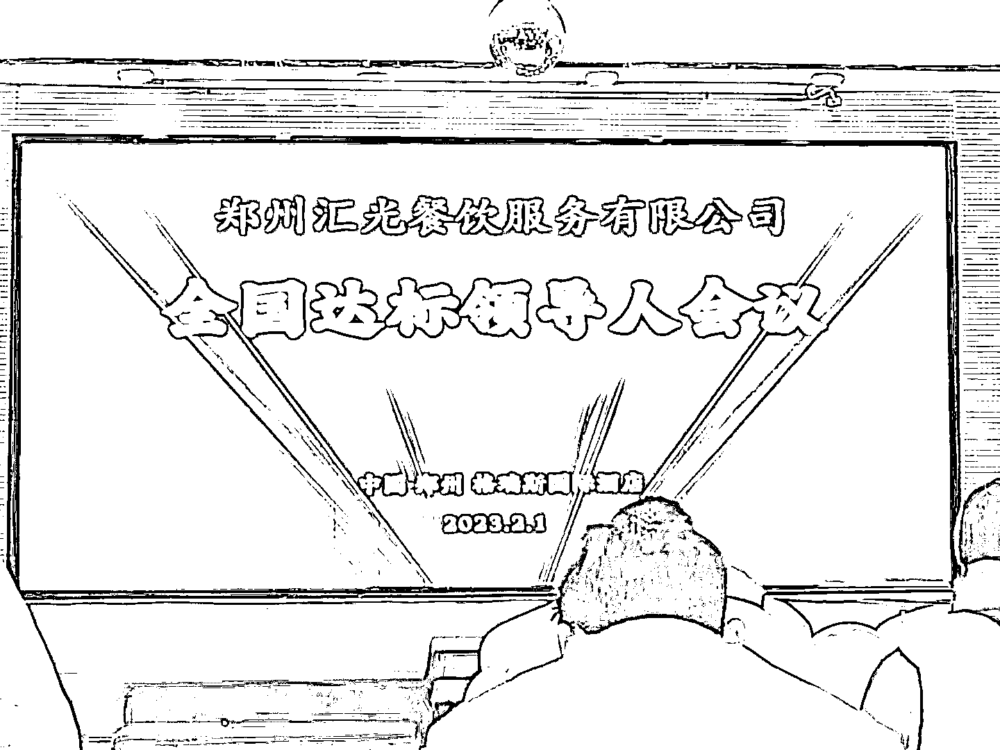
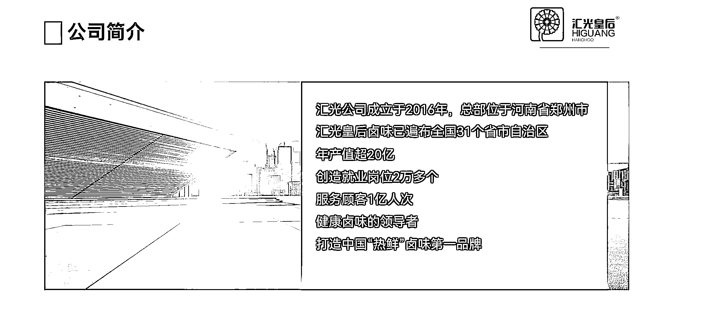
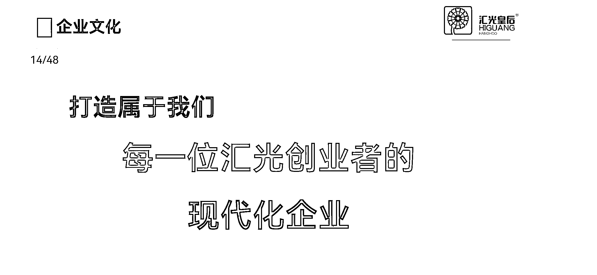

# 线下小吃加盟，卖卤味又卖设备

> 原文：[`www.yuque.com/for_lazy/xkrm14/mxipm9zxg4ggcy9r`](https://www.yuque.com/for_lazy/xkrm14/mxipm9zxg4ggcy9r)

作者： 秋冬。

日期：2023-03-13

点赞数：33

<ne-hole id="ue45fb057" data-lake-id="ue45fb057">

正文：

一个小推车项目 一个微商项目 一个邻理项目 一个餐饮项目 一个卖设备项目 一个副业项目 …… 以上所有项目都是一个项目，我家门口卖卤味的项目，汇光皇后卤味，吃的还不错，我经常买，这个项目真的是非常非常的神奇 每个小区都有他 老板异常的热情 东西可以免费送 付款必须加好友 卖卤味又卖设备 小众刚需又爆款 不知道你家门口有没有！这个项目的加盟模式还有管理模式我研究了很长很长时间，一直研究不透彻，有了解的小伙伴，可以私聊一下我，我想学习学习这个模式！！

  <ne-p id="uab26bcdd" data-lake-id="uab26bcdd">  <ne-p id="ubdc9c088" data-lake-id="ubdc9c088">  <ne-p id="u18f83dd7" data-lake-id="u18f83dd7">  <ne-p id="u343306c7" data-lake-id="u343306c7">  <ne-p id="u79a5d1c4" data-lake-id="u79a5d1c4">  <ne-p id="ud2573856" data-lake-id="ud2573856">  <ne-p id="u6a0afa78" data-lake-id="u6a0afa78">  <ne-p id="ufa27e6b8" data-lake-id="ufa27e6b8">  <ne-hole id="u1259c30e" data-lake-id="u1259c30e"><ne-p id="ua93bb5ad" data-lake-id="ua93bb5ad">评论区：

秋冬。 : 希望三位大佬可以研究，分享一下。[呲牙][呲牙][呲牙]

秋冬。 :

安神 : 我们小区门口有卖，经常买，口味不错

秋冬。 : 口味可以的

金春春 : 抖音搜索一下就知道了，这玩意是真的难吃😂😂

秋冬。 : 挺好吃的啊，我家附近都是这个牌子的 一个小区一个😂

金春春 : 合肥这边也有很多，我吃了这些，都是一下冰冻，水煮撒辣椒油。柴而且不入味，好像五千多帮忙弄好一个位置

小马宋 : 这个我真的研究过，一年做十几亿的销售额，牛逼的。

<ne-hole id="uf604c70c" data-lake-id="uf604c70c">

公众号懒人找资源，懒人专属群分享

</ne-hole></ne-hole></ne-p></ne-p></ne-p></ne-p></ne-p></ne-p></ne-p></ne-p></ne-p></ne-hole>