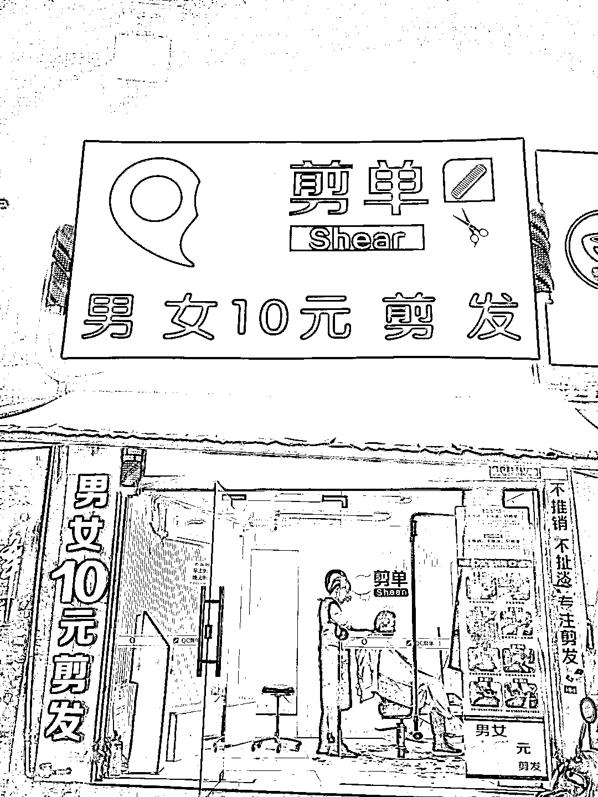
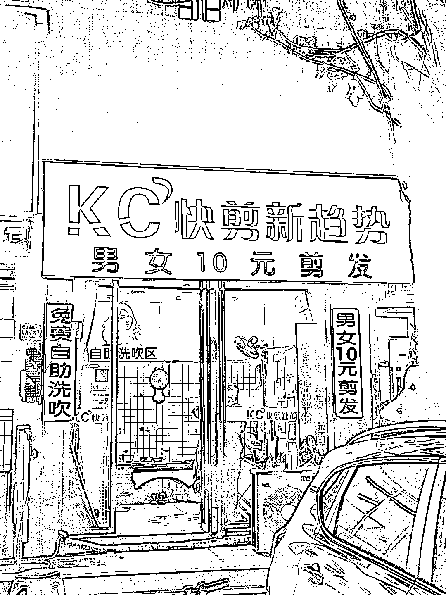
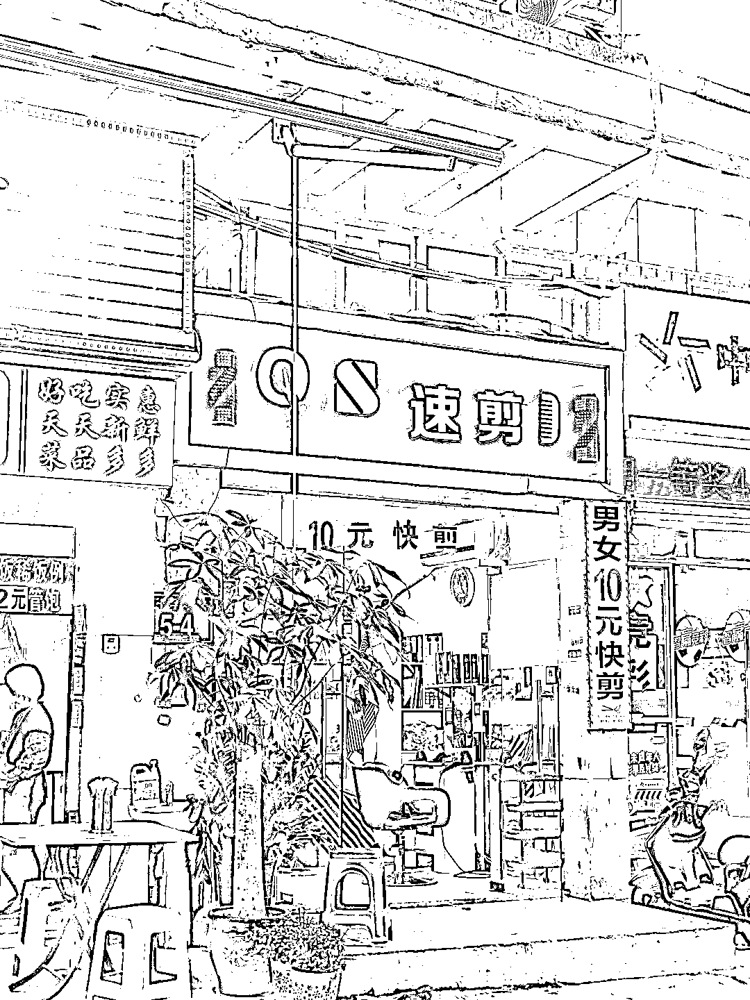

# 二线城市快剪理发店，月入近万

> 原文：[`www.yuque.com/for_lazy/xkrm14/rvaq1pbp0hgr0fw5`](https://www.yuque.com/for_lazy/xkrm14/rvaq1pbp0hgr0fw5)

作者： 辛禾

日期：2023-03-13

点赞数：12

<ne-hole id="ufa0b950d" data-lake-id="ufa0b950d"><ne-card data-card-name="hr" data-card-type="block" id="xtbgc" data-event-boundary="card">

正文：

二线城市开个一人快剪理发店，月入近万？ 小区附近街区不到百米的范围，随便一逛就有超过 10 家理发店，都是类似图片这种主打邻里生意的店型。刚好有理发需求，于是找了路口一家店进行了体验。 经一番聊天，该店是加盟的一种形式，品牌方提供下单排队机子（方便订单销售额统计）+每月店租水电 5000+，利润双方分成。目前价格白天 10 元晚上 15 元，日均 50 人左右（要站很久），周末人会更多，一日营业额 250+375（按各半算），每月 18750，折合每月 9000 多，相当于拿个不错的工资了 当然，估计他这个选址（周边人口多，路口位置相对曝光性好点）和本人理发技术不错，做的是回头客生意，收入应当挺稳定的。如果会结合私域做些养发护发咨询和带货也有一定增收空间

<ne-card data-card-name="image" data-card-type="inline" id="KYnj7" data-event-boundary="card">  <ne-p id="u0f58f41d" data-lake-id="u0f58f41d"><ne-card data-card-name="image" data-card-type="inline" id="MGU9k" data-event-boundary="card">  <ne-p id="u9e743d55" data-lake-id="u9e743d55"><ne-card data-card-name="image" data-card-type="inline" id="rGrwo" data-event-boundary="card">  <ne-hole id="uf943c74d" data-lake-id="uf943c74d"><ne-card data-card-name="hr" data-card-type="block" id="RfHIi" data-event-boundary="card"><ne-p id="ud407e8e3" data-lake-id="ud407e8e3">评论区：

<ne-hole id="ud1ea689c" data-lake-id="ud1ea689c"><ne-card data-card-name="hr" data-card-type="block" id="HwdAR" data-event-boundary="card">

公众号懒人找资源，懒人专属群分享

</ne-card></ne-hole></ne-card></ne-hole></ne-card></ne-p></ne-card></ne-p></ne-card></ne-p></ne-card></ne-hole>