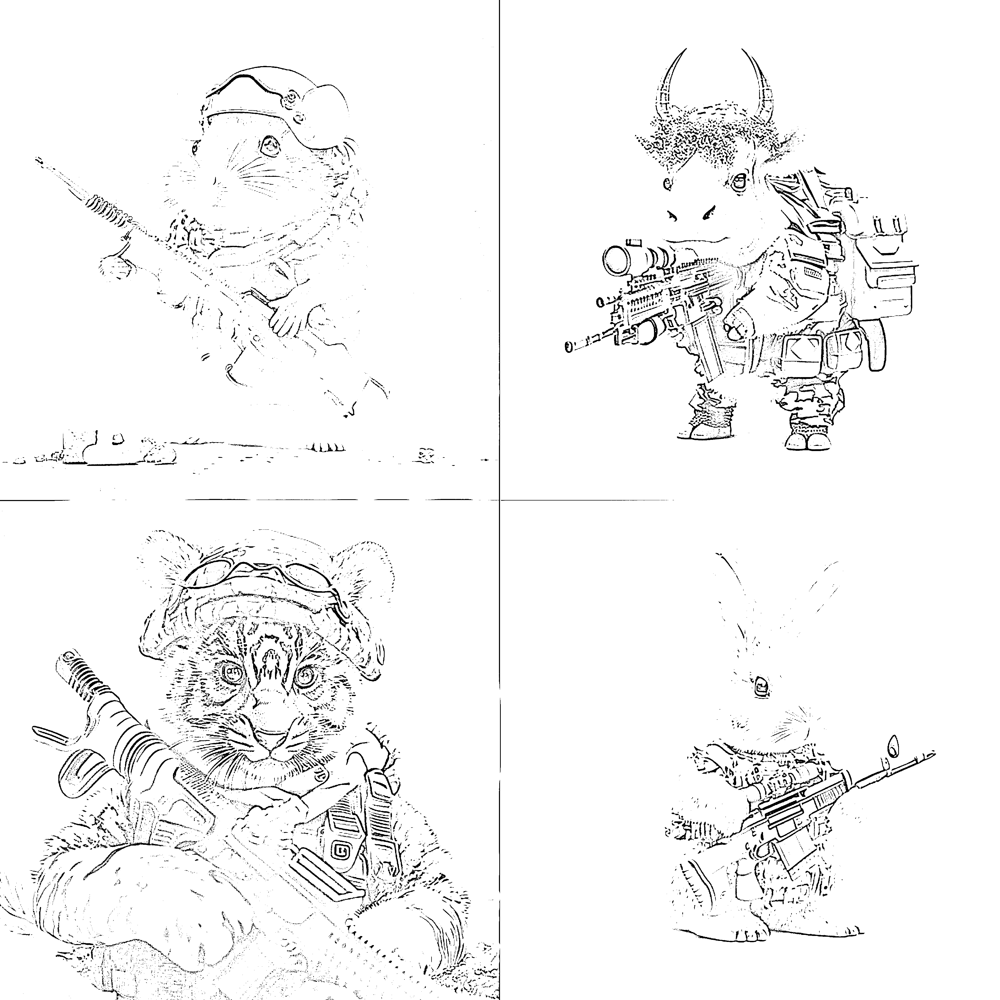
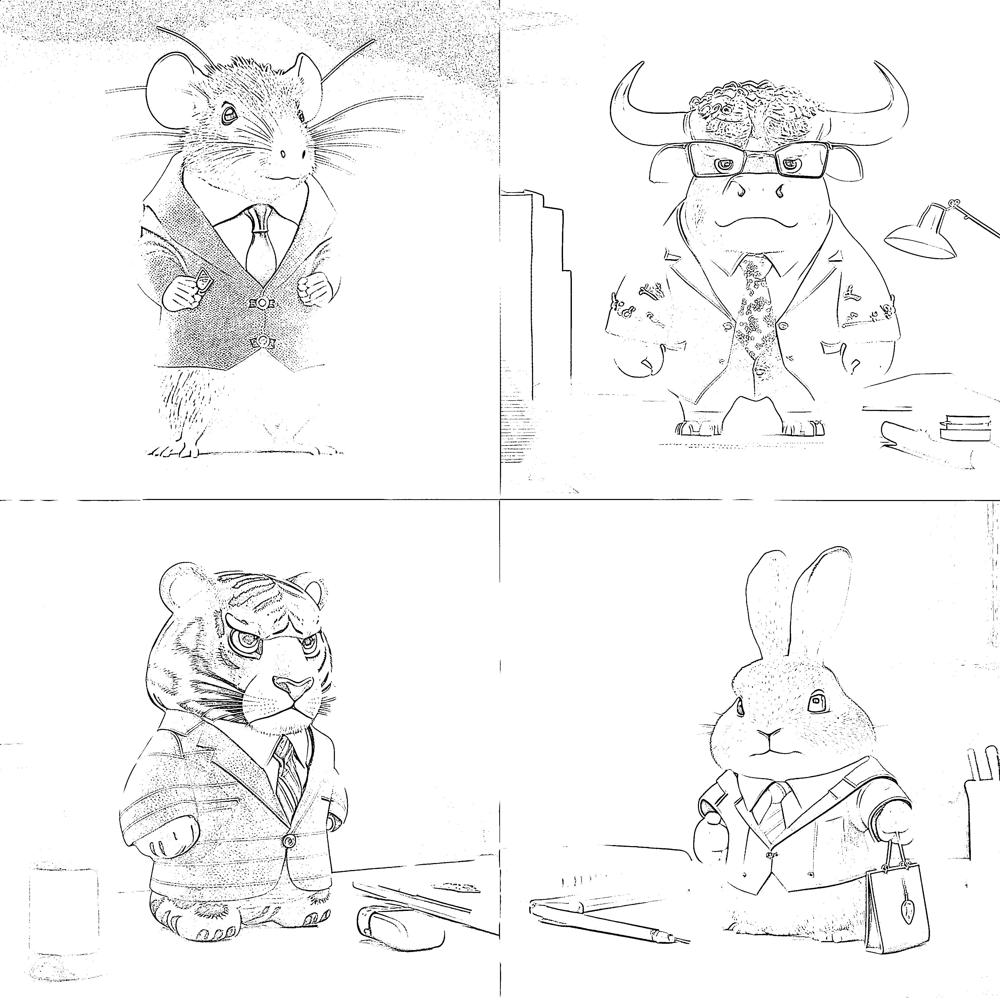
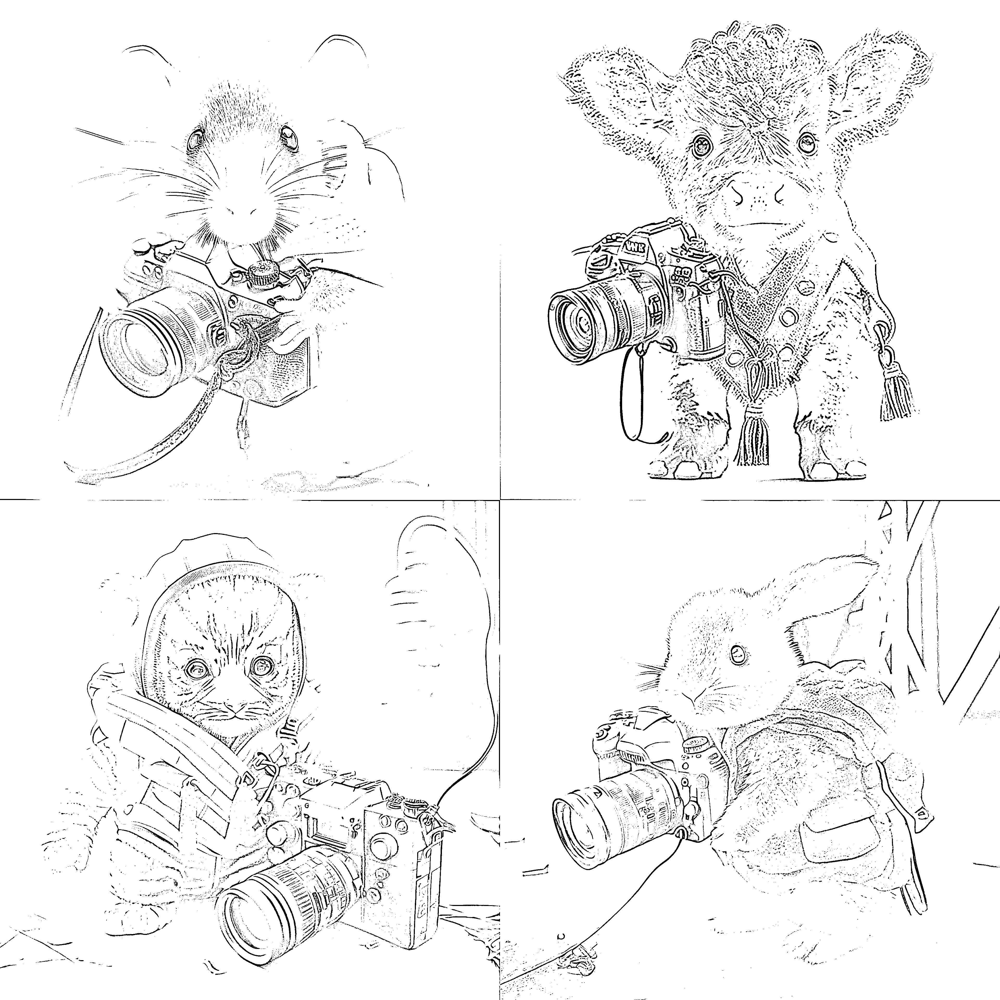

# 将 Midjourney 接入 AI 绘画小程序，生成专属头像

> 原文：[`www.yuque.com/for_lazy/xkrm14/di2omqhqp7l0rm2k`](https://www.yuque.com/for_lazy/xkrm14/di2omqhqp7l0rm2k)

作者： 离心之巅

日期：2023-03-29

点赞数：47

正文：

十二生肖壁纸在各大平台都比较火，midjourney 同一组关键词只需要修改对应动物和职业就可以生成不同的图。思路扩展下，可不可以做个 ai 绘画小程序接入 midjourney，只需要用户输入他的生肖和职业，不懂 ai 绘画的小白也能生成自己专属头像

评论区：

