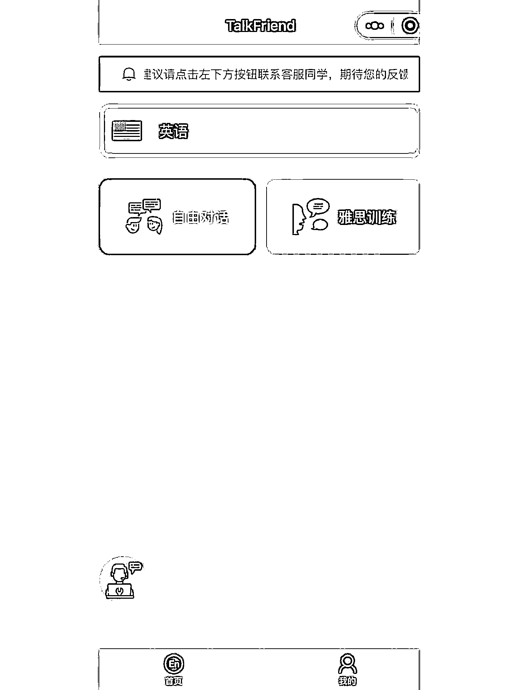
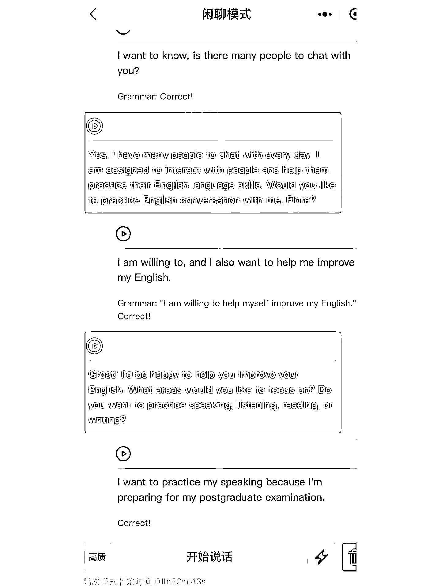

# chatgpt+真实应用场景开发思路

> 原文：[`www.yuque.com/for_lazy/xkrm14/yi8pfvuny19iuxs6`](https://www.yuque.com/for_lazy/xkrm14/yi8pfvuny19iuxs6)

作者： 米笠

日期：2023-03-28

点赞数：38

正文：

chatgpt+真实应用场景开发思路 这两个公众号都是专门做口语练习的 也是 chatgpt 的真实应用场景 强需求，而且不违规 做开发的圈友可以参考这个思路进行开发。

  

  

  

  

评论区：

安心 : 请问 chatgpt 接入公众号，微信不是违规的么？我有点蒙[捂脸]

米笠 : 是的，但是垂直应用的这个场景是最没有其他风险的。

