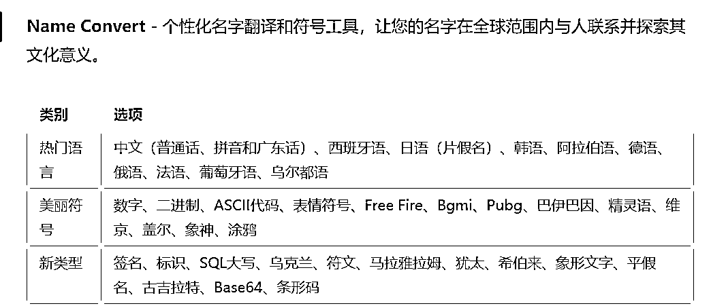

# NAMEBRIDGE 专门给英语国家起中文名字

> 原文：[`www.yuque.com/for_lazy/xkrm14/dhd0dn9lgbg0szom`](https://www.yuque.com/for_lazy/xkrm14/dhd0dn9lgbg0szom)

作者： 良辰美

日期：2023-03-24

点赞数：27

正文：

参考圈友的路径，跟随大家的脚步，做了个起名的虚拟产品，主要是针对海外。 有个华人程序员做了 NAMEBRIDGE 专门给英语国家起中文名字，我这个是可以把取任何你想要的名字：各国语言，符号表情，平台昵称等等。 现在刚做好 GUMROAD 的产品落地页，自动化流程还在调试中，域名买了配合落地页和社媒的营销还没来得及做。 最近 ChatGPT 超级大爆发，想多上点海外版和亚马逊专业产品工具，真是有场景有需求就可以通过它无代码实现功能。 由于是前面工作都是面向海外版的全英文界面，这里就只放飞书的表单吧，感兴趣的圈友可以填免费给你做。 [问卷标题](https://fs.fanqier.cn/f/n6zphriq)

  

  

  

  

评论区：

良辰美 : 感谢鱼的沟通和交流，还有陈怀哲和 Fredrich 的生财文章： 鱼通过风向标和 GPT4 做出个性化定制名人来信 陈怀哲通过低代码工具和 GPT4 做产品落地页 Fredrich 不是程序员也可以通过自动化流程工具提高生产力和变现[利用+GPT4+迅速将想法落地，让创意在半天时间内变成+MVP](https://t.zsxq.com/0ce4hcasx) [https://t.zsxq.com/0cs8PTDKy](https://t.zsxq.com/0cs8PTDKy) [https://t.zsxq.com/0cp8zmd0h](https://t.zsxq.com/0cp8zmd0h)

