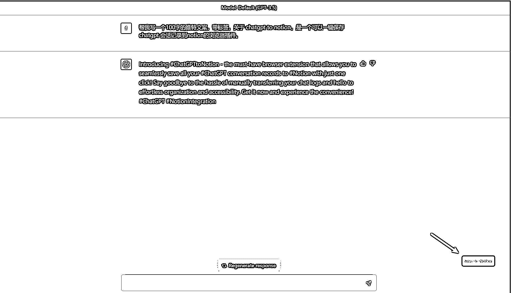
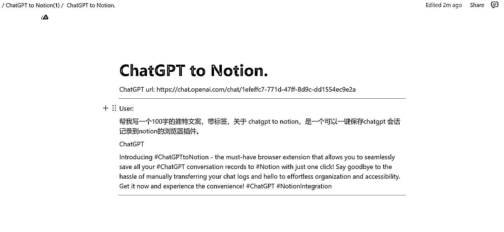
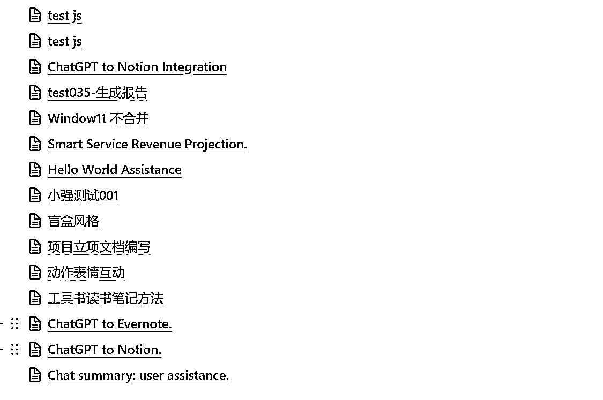

# ChatGPT to Notion，轻松地将所有 ChatGPT 会话记录保存到 Notion

> 原文：[`www.yuque.com/for_lazy/xkrm14/qs3fqlkxpvnsk6is`](https://www.yuque.com/for_lazy/xkrm14/qs3fqlkxpvnsk6is)

作者： 啊洛

日期：2023-03-24

点赞数：30

正文：

介绍一下 ChatGPT to Notion - 这款必备的浏览器插件，可以让您轻松地将所有 ChatGPT 会话记录保存到 Notion，只需单击一次即可完成！告别手动转移聊天记录的麻烦，享受轻松的组织和访问。立即获取，体验便捷！ 下载地址： [[https://chrome.google.com/webstore/detail/chatgpt-](https://chrome.google.com/webstore/detail/chatgpt-)... ]([https://chrome.google.com/webstore/detail/chatgpt-to-](https://chrome.google.com/webstore/detail/chatgpt-to-)notion/bknieejaaomeegoflpgcckagimnbbgdp)[ChatGPT+to+Notion](https://chatgpt2notion.com/)

  

  

评论区：

啊洛 : 视频演示地址： [https://gczff68td0.feishu.cn/docx/A0bHdegOLoIcrCxH...](https://gczff68td0.feishu.cn/docx/A0bHdegOLoIcrCxHDyscHFk0nYt)

