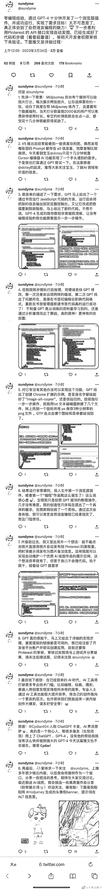

# 用 AI，0 编程经验，10 分钟开发了插件

> 原文：[`www.yuque.com/for_lazy/xkrm14/agukwn9i5uco6v3d`](https://www.yuque.com/for_lazy/xkrm14/agukwn9i5uco6v3d)

作者： vicky

日期：2023-03-24

点赞数：24

正文：

0 编程经验，10 分钟开发了插件！！！

  

评论区：

阿智 : 它生成的插件容易有 bug，还是需要点编程知识 ，才能更好的实现自己的需求。

