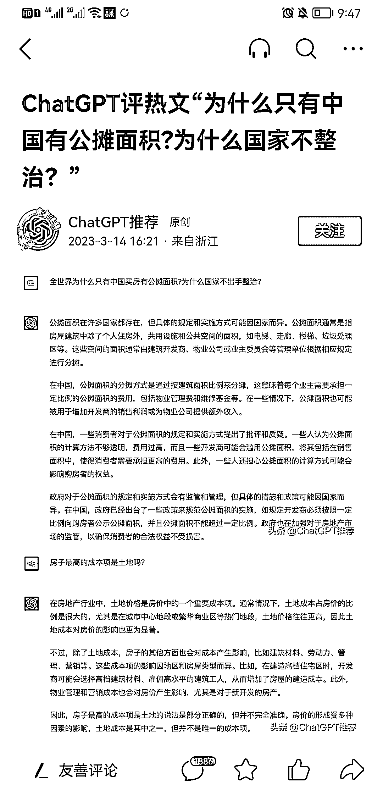

# 通过 ChatGPT 提问在头条号把内容发布成文章，筛选有吸引力的题目

> 原文：[`www.yuque.com/for_lazy/xkrm14/gb1l03n4rpgvozkh`](https://www.yuque.com/for_lazy/xkrm14/gb1l03n4rpgvozkh)

作者： will

日期：2023-03-24

点赞数：125

正文：

通过 ChatGPT 提问，在头条号把内容发布成文章，筛选的题目有吸引力，文章标题模板：『ChatGPT:XXXX 问题？』经常出几万到几十万阅读文章，赚取爆文流量收益，爆文还可以多平台同步更新一鱼多吃～

  

  

  

  

评论区：

milla_wen : 马上冲去发了一个微头条，晚点来汇报数据[偷笑]

will : [机智]

金九渊 : 立马冲

波叔 : 666

小来 : 立马冲！

陈真 : 这个我也可以冲一波，之前都是把他的回答再加上图片，感觉不如这样的有吸引力。

陈小胖 : 这种方式我在微博试过，有人看，但是不涨粉。

大理阿彬 : 刷新了两天了，数据有了没[奸笑]

