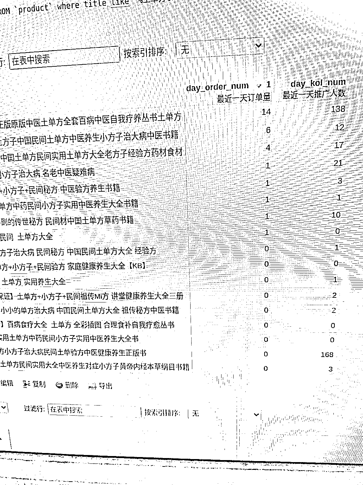

# 抖音穿山甲账号，掌握准确的官方数据

> 原文：[`www.yuque.com/for_lazy/xkrm14/gu6gvyubkz9wxepu`](https://www.yuque.com/for_lazy/xkrm14/gu6gvyubkz9wxepu)

作者： 陈文根

日期：2023-03-30

点赞数：96

正文：

有做抖音视频号的朋友建议去注册一个穿山甲账号，里面有个乘风计划接口，抖音直播数据，视频数据，什么品每天卖多少量，多少达人带货，竞争怎么样，接口可以获取到，最主要的是官方数据，准确，比第三方的准！就是一座大金矿，等着你去挖掘！1 数据采集下来分析，什么品卖得好，会爆，再通过商品标题，去蝉妈妈找对应带货的品视频！接口文档地址: 附上图片我采集下来查看土单方昨天的数据！[[https://lf3-plat.pglstatp-toutiao.com/obj/union-pl](https://lf3-plat.pglstatp-toutiao.com/obj/union-pl)... ]([https://lf3-plat.pglstatp-toutiao.com/obj/union-](https://lf3-plat.pglstatp-toutiao.com/obj/union-)platform/2db2f2123e182f963774784a7ba755df.pdf)

  

评论区：

短视频 I 直播 I : 这个是付费版的吗

陈文根 : 免费，官方开放的接口，官方也走分销这一套，所以要开放接口！

Charliex : 这就去注册

小熊 : 账号注册了，请问是要下载你发出来的这个接口，才能看到这些数据吗？

紫色的彩虹 : 注册就能看，还是只是提供接口

陈文根 : 只提供接口

陈文根 : 要自己对接接口

紫色的彩虹 : 不是程序员就不懂弄了哈

