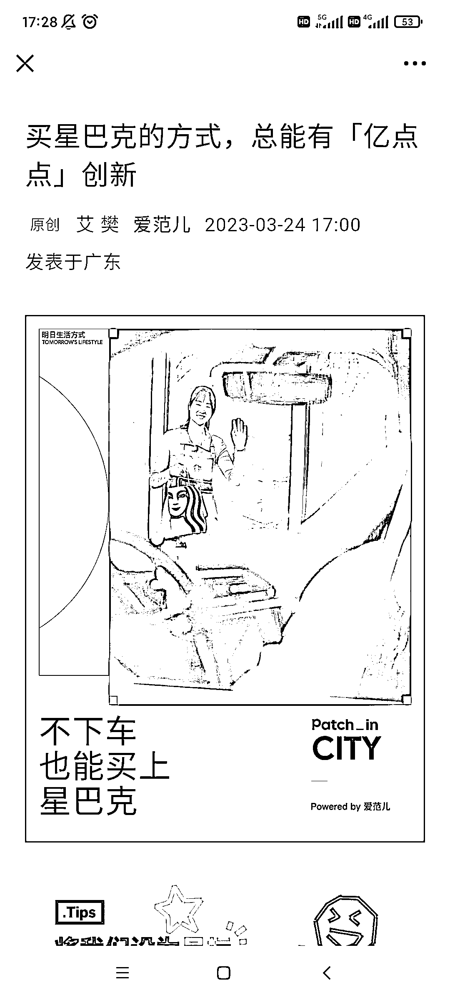
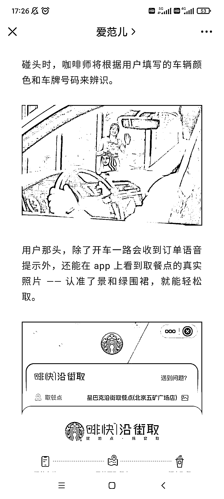

# 星巴克宣布和高德联手打造的全新零售渠道「沿街取」正式登场

> 原文：[`www.yuque.com/for_lazy/xkrm14/cuegmctqeabwprnb`](https://www.yuque.com/for_lazy/xkrm14/cuegmctqeabwprnb)

作者： 阿黎

日期：2023-03-24

点赞数：30

正文：

星巴克宣布和高德联手打造的全新零售渠道「沿街取」正式登场。 瞄准了开车的用户，把第三空间延伸到了「路上」。 会有更多相关品牌，平台，试点城市，试点区域，跑步跟上 每一个方面的因素，都有机会 比如，机场那么大，咖啡只有一两家，我赶时间，还得穿越半个机场去取，不喝了。 但如果有人在安检后面等我，我次次下。 在这个真空期，可以招一批美团小哥，延伸出类似服务，负责一个区域，比如代取某个商场的所有外卖品牌，在商场路边等下单的客户: 车牌 888 的李女士您好，这是您的 KFC 和喜茶，请慢用，用餐愉快，再见

  

  

  

  

评论区：

Luke 王子 : 让我想起了 美国麦当劳和高速收费站合作 ，进闸顺便点一份餐了

阿黎 : 这个服务不错 和现在一些加油站加满 xx 元，送洗车一样

公众号懒人找资源，懒人专属群分享

