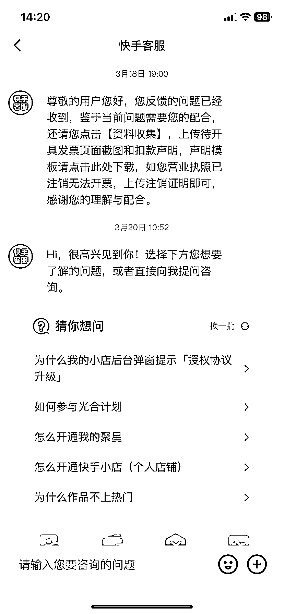
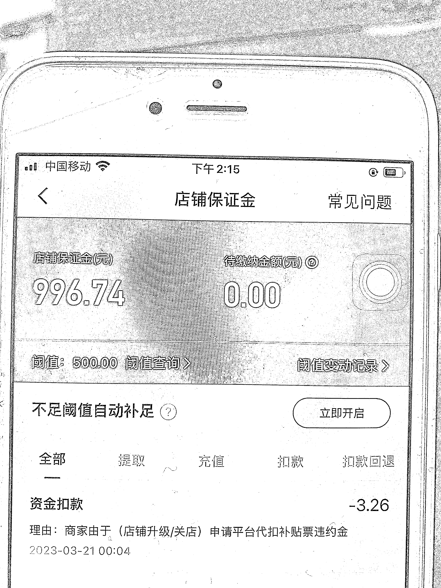

# 快手注销经验分享

> 原文：[`www.yuque.com/for_lazy/xkrm14/mtulgzr77z3f0k75`](https://www.yuque.com/for_lazy/xkrm14/mtulgzr77z3f0k75)

作者： 不亦樂乎

日期：2023-03-29

点赞数：16

正文：

快手小店注销经验 之前做快手店群，现在不做了，快手小店要注销。 由于营业执照是异地的，无法给平台开具相应的发票，导致关店流程一起卡着。一开始客服一直说没办法，导致迟迟无法关店拿回保证金。 后来解决了。 解决方法： 1.打电话给快手客服，态度好一点，说自己做快手小店亏了很多钱，现在急着拿回保证金，去还债。请她帮忙想想办法。（这个时候她说要去请示领导，等她回电话）客服电话：400-101-5454 2.等客服回电话后，根据她要求提供两个资料即可，1⃣️身份证，2⃣️申请表签字盖章（没有章按指纹） 3.提交后两个工作日左右，从保证金扣除对应的费用，就可以正常注销拿回保证金了。

评论区：

