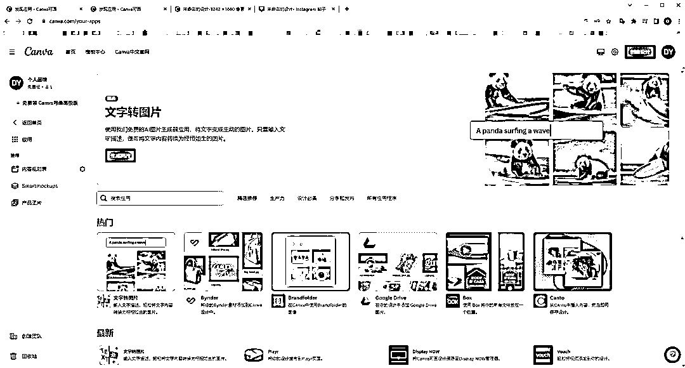
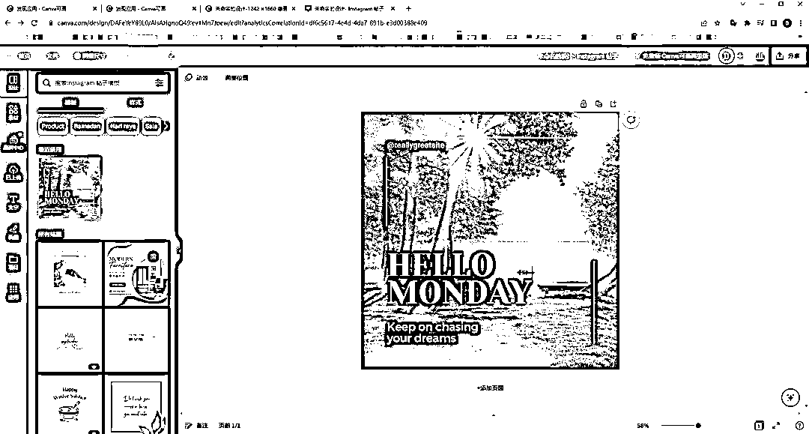

# 分享一个提高小红书做图效率的工具

> 原文：[`www.yuque.com/for_lazy/xkrm14/vxagvxf6tfmxeiyu`](https://www.yuque.com/for_lazy/xkrm14/vxagvxf6tfmxeiyu)

作者： 段段

日期：2023-03-27

点赞数：32

正文：

分享一个提高小红书做图效率的工具 应用里，可以使用 text to image，利用文字生成自己需要独一无二的 ai 图片，风格可选，使用简单，生成的照片类型的图片很真实（图二） 可使用 text to image 功能里的图片设计，文字，素材，大量模板可以用来制作小红书图片，来提高效率（图三） 该网站图片和设计偏向欧美，跨境电商也可以利用它生成产品图片，不会造成侵权[Just+a+moment...](https://www.canva.com/)

  

  

  

评论区：

