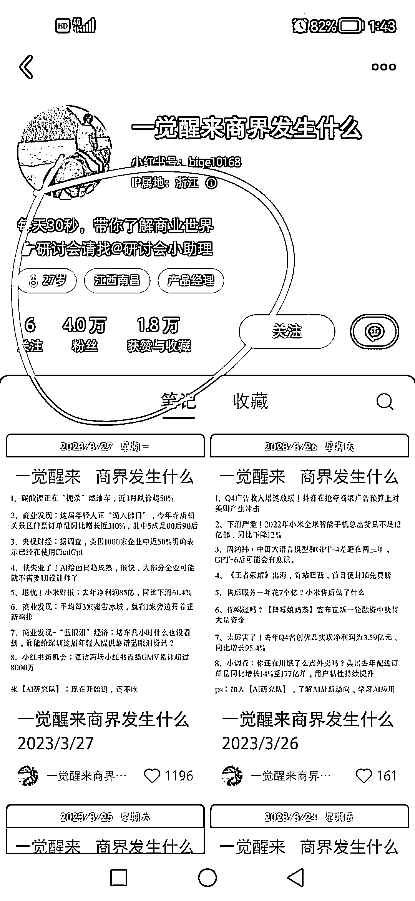
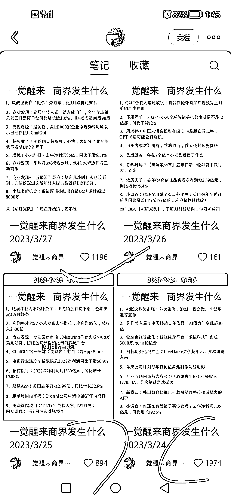

# 小红书「一觉醒来世界发生了什么」系列，可做垂直内容

> 原文：[`www.yuque.com/for_lazy/xkrm14/dg77xmwoh69i83nk`](https://www.yuque.com/for_lazy/xkrm14/dg77xmwoh69i83nk)

作者： 老彭

日期：2023-03-27

点赞数：21

正文：

前不久，火了一系列的每日新闻账号，比如「一觉醒来世界发生了什么」这个账号… 这几天刷小红书，没想到这个系列的细分账号也在火，比如这个账号没做多久也 4 万粉丝了，它做的是每日商界新闻…(这个细分比每日新闻还要更好更容易引流到其他账号变现) 另外，每日新闻的细分，可延伸的角度可不止商界，还可以有医疗、证券、教育、美食等等…

评论区：

Drake 赵 : 新闻号怎么变现？

金九渊 : 我也想知道

