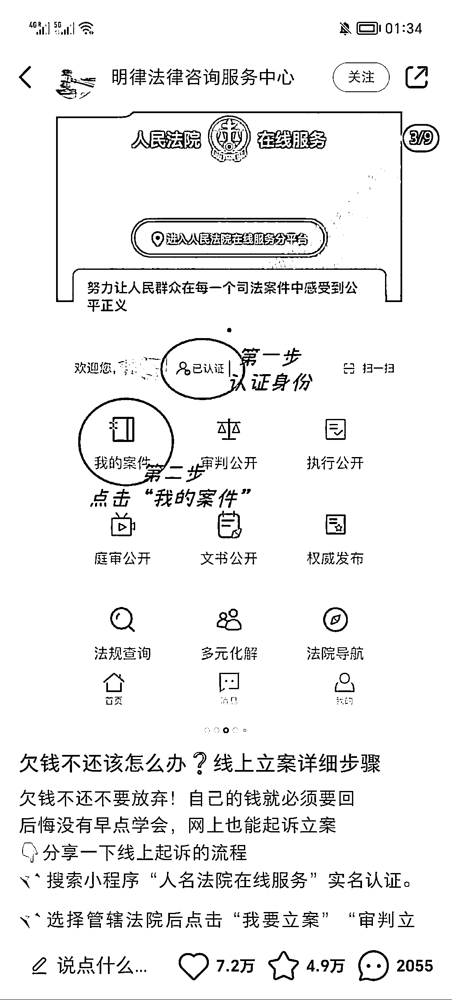
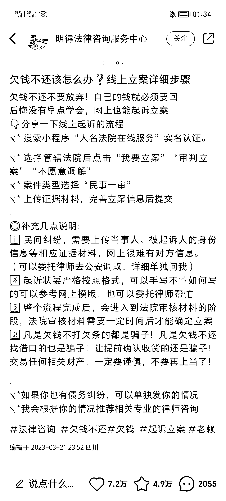
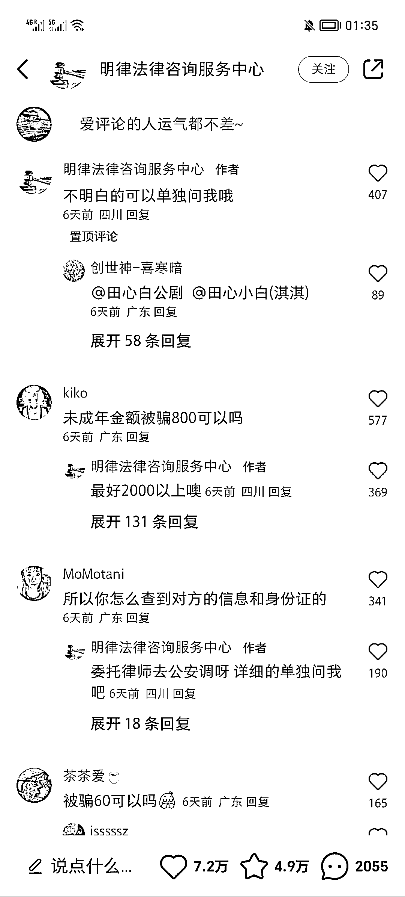

# 小红书，借钱起诉类笔记数据真好

> 原文：[`www.yuque.com/for_lazy/xkrm14/zeoh5gxs46x0gu4i`](https://www.yuque.com/for_lazy/xkrm14/zeoh5gxs46x0gu4i)

作者： 米笠

日期：2023-03-27

点赞数：21

正文：

小红书，借钱起诉类笔记数据真好 利用朋友圈对话形式做笔记 主要内容是借钱不还，拉黑，然后起诉，对方主动来还钱。 现在被借钱的人太多了，很多人有这类起诉需求，这类笔记容易产生共鸣。 可以利用笔记，引流私域。 卖法律咨询服务，和起诉书。

  

  

  

  

评论区：

暂无评论

