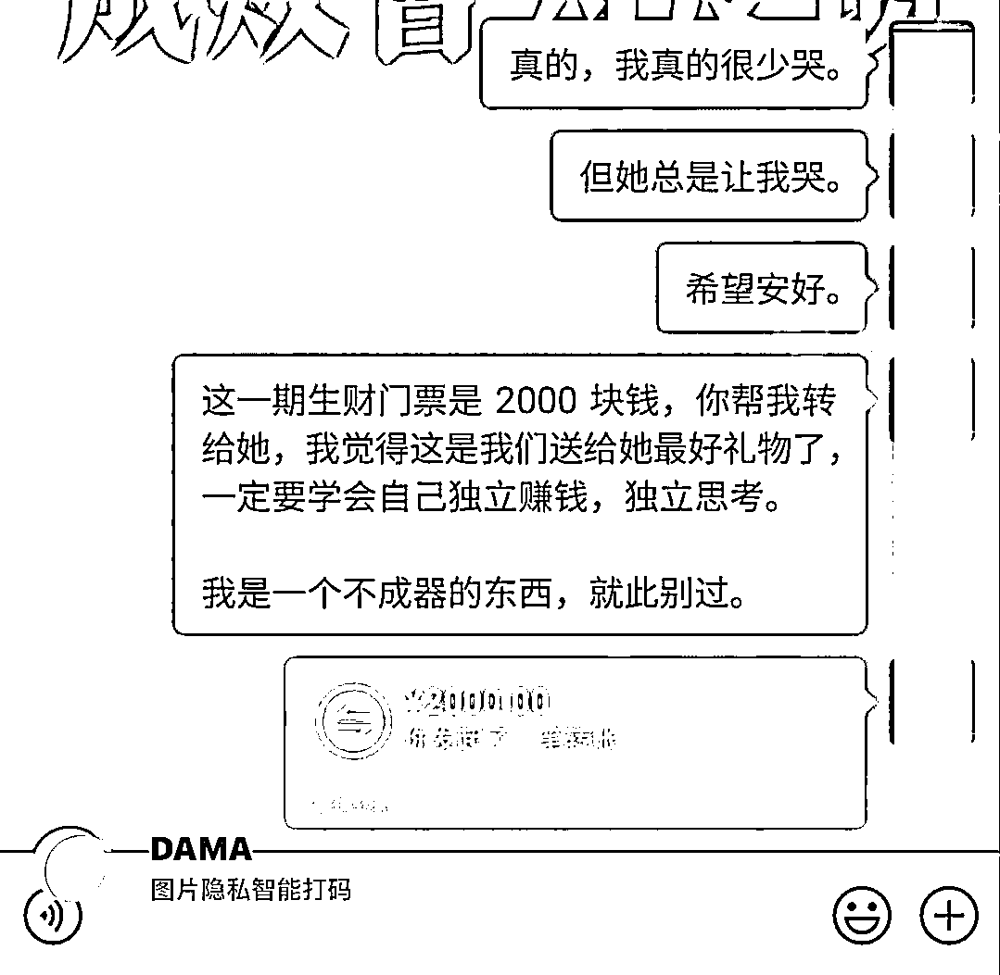

# 将分手礼物赋予意义

> 原文：[`www.yuque.com/for_lazy/xkrm14/zvmv6olpxh89atsq`](https://www.yuque.com/for_lazy/xkrm14/zvmv6olpxh89atsq)

作者： 米杰

日期：2023-03-30

点赞数：107

正文：

赋有意义的分手礼物！ 这位圈友，在和心爱多年的女朋友分手那一刻做了一件让人热泪盈眶的事情。 面对那个曾伤透了他的心的女孩，他选择用“最新一期生财门票”作为最后的告别礼物，希望她能够成为一名的“生财圈友”。 拥有“独立赚钱”“独立思考”的能力。 爱一个人最伟大的方式，是让他在面对风雨中依旧能够独立成长。就像父母的爱一样，让孩子拥有独立的社会实践能力，也许是父母对孩子的另外一种保护吧！ （发布内容已征得圈友本人同意）

评论区：

老彭 : Dama 是什么，小程序吗，还是 app

三笙 : 如果不是真的，我以为是软文，哈哈

米杰 : app

无匠心，不设计 : 这……

瓜藤 : 潇洒

渔夫 : 牛逼

米杰 : 其实，最开始我很想安慰一下这个圈友。但是，我发现他太理性了，我欲言又止[皱眉][皱眉][皱眉]

米杰 : 艺术源于生活

公众号懒人找资源，懒人专属群分享

