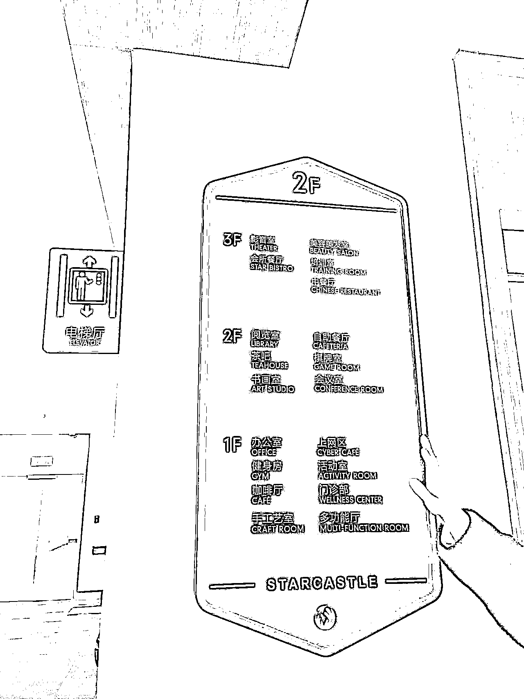

# 线下高端的持续照料型养老社区，需求大

> 原文：[`www.yuque.com/for_lazy/xkrm14/uvkhktzgc91u8c4y`](https://www.yuque.com/for_lazy/xkrm14/uvkhktzgc91u8c4y)

作者： ℡Theone

日期：2023-03-27

点赞数：11

正文：

高端的持续照料型养老社区，社区所处地段好、交通便利、医疗资源丰富。

  

  

  

  

  

  

评论区：

黄小刀🔪 : 这种上海就人多，根据房型不一样价格几千不等，去参观过几次，住的大多数是退休金不低的行动正常的老年人。在这里像一个老年大学，他们非常快乐

