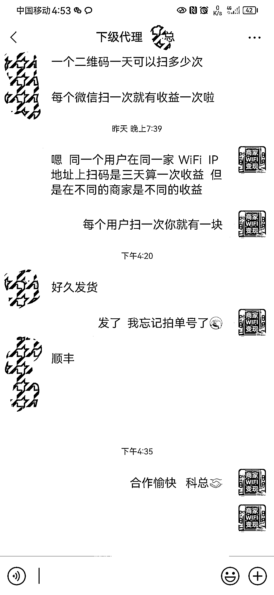

# 线下 WiFi 扫码变现思路

> 原文：[`www.yuque.com/for_lazy/xkrm14/bh21qognhu7ug6se`](https://www.yuque.com/for_lazy/xkrm14/bh21qognhu7ug6se)

作者： 北海小塘

日期：2023-03-27

点赞数：17

正文：

朋友圈看到有人做 WiFi 扫码变现。 现在有一种技术把连 WiFi 的密码过程变成扫二维码，用户在扫码连 WiFi 的过程中会有一段广告时间，每扫一次，商家和推广人都可以获得分成。 需要自己注册公司，成为代理，然后全国招商，不断推广。

  

评论区：

宋词 : 周六在杭州的民宿就扫了

大峰 : 做这个成本不高，看模式和精力

天择 : 扫一次有一块？我记得才一周之内同一用户才几分钱还是更低去了

北海小塘 : 第一次新用户可能有的话有一块钱吧，具体没问

闲米 : 我问过一家，3 毛一次

北海小塘 : 代理商与上级代理都有分成

北海小塘 : 只要人流量大，铺的店多，确实能自动收入这个也不错了

十月 : 请问哪位大佬有技术实现方案分享吗

公众号懒人找资源，懒人专属群分享

