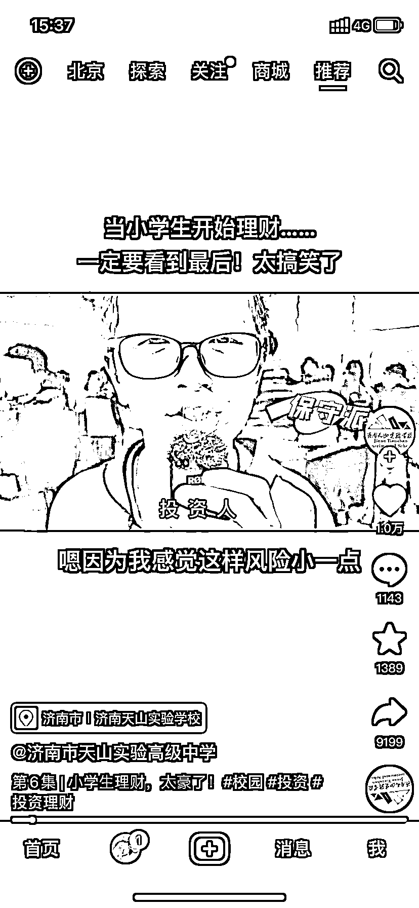

# 思路：可以开发一套针对未成年人的财商课

> 原文：[`www.yuque.com/for_lazy/xkrm14/hf31f9999zr316z0`](https://www.yuque.com/for_lazy/xkrm14/hf31f9999zr316z0)

作者： 太波

日期：2023-03-24

点赞数：30

正文：

一个小学，给孩子做投资的学习，并上手实践，有银行存款，低风险理财，高风险理财，广受好评，所以，是不是可以开发一套针对未成年人的财商课，了解基本的商业常识，和经济规律，就像小狗钱钱和小岛经济学那样的通俗易懂，应该很受欢迎

评论区：

我的执着 : 有 微淼

