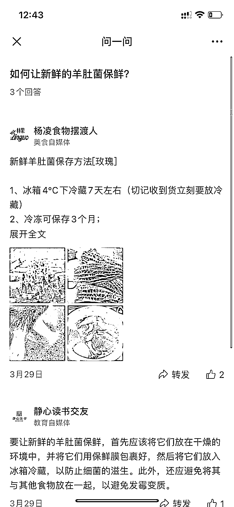

# 微信问一问，提前布局回答

> 原文：[`www.yuque.com/for_lazy/xkrm14/yrhlgbeigddsr459`](https://www.yuque.com/for_lazy/xkrm14/yrhlgbeigddsr459)

作者： 韵韵

日期：2023-03-31

点赞数：58

正文：

在微信上搜索，「问一问」的入口出现了，我刚刚搜了「羊肚菌」一次，才 3 个回答，目测可以开始布局了？有点像知乎问答~

评论区：

暂无评论

