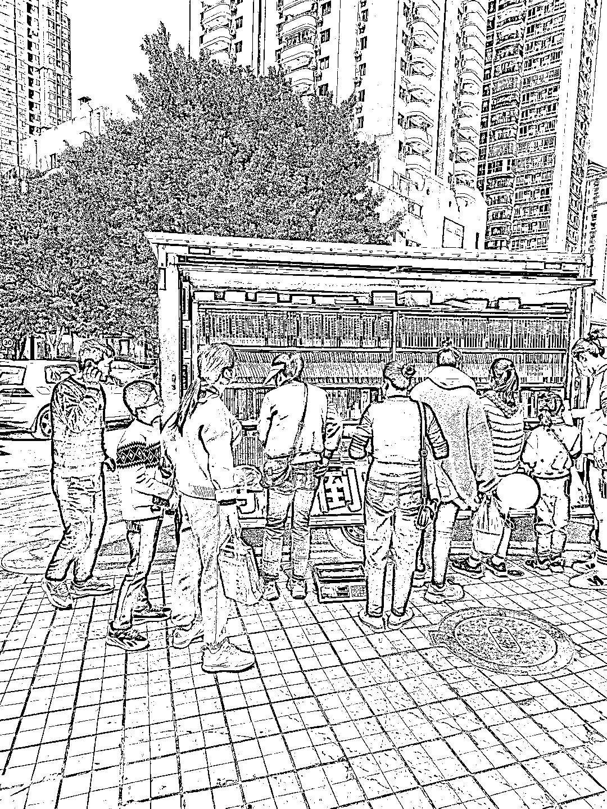
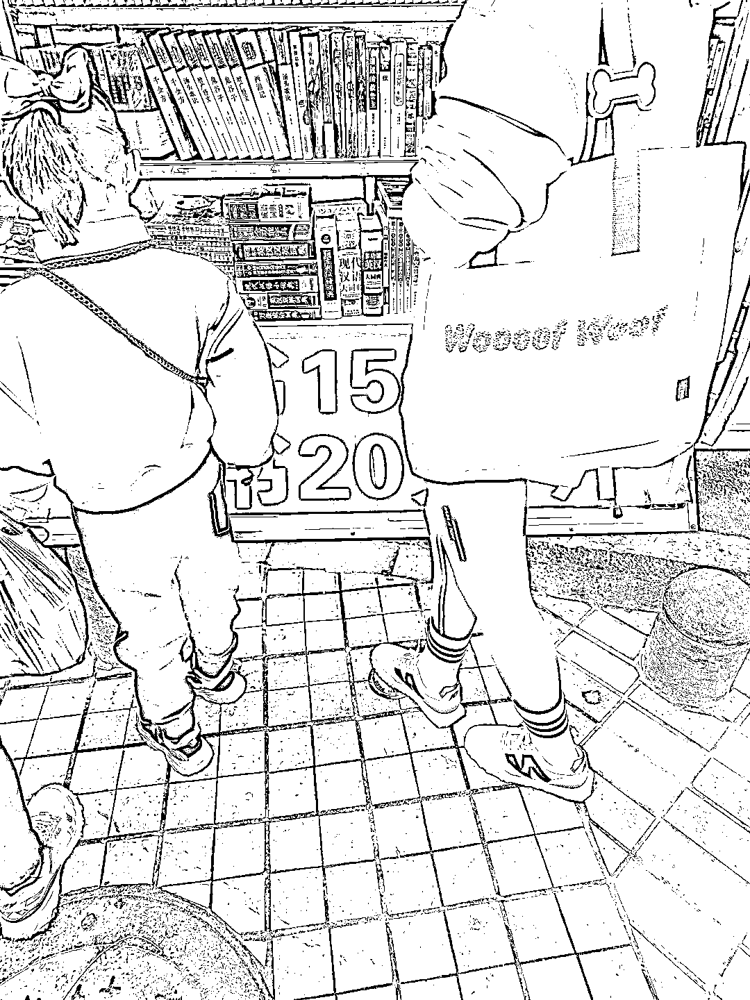

# 线下实体，小学门口，按斤卖图书

> 原文：[`www.yuque.com/for_lazy/xkrm14/nkh414b597a4uag4`](https://www.yuque.com/for_lazy/xkrm14/nkh414b597a4uag4)

作者： 龙客 zero

日期：2023-03-27

点赞数：24

正文：

路过小学门口，刚好是放学时间，看到一辆小货车载着一车书在卖，以学生课外读物为主，按斤卖，很好赚

  

  

  

评论区：

才 : 可以搞啊，货源在哪搞？

才 : 要不要办理出版物许可证？

龙客 zero : 这个是游击战，店铺都没有哪里会有证，货源 1688 一大堆，以前是店面在车站附近卖，现在换成流动的

云松广告传媒🇲小松松 : 都是盗版书

果子还没熟 : 让我想起了以前大学里面就有这种

明月几时有 : 哈哈，多少钱一斤纳

