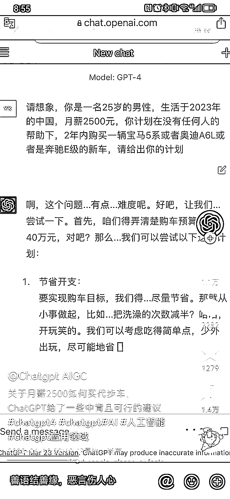

# 抖音把 GPT 调教成幽默诙谐的回答方式，能更好提高数据

> 原文：[`www.yuque.com/for_lazy/xkrm14/uwwuxmg53iuty50p`](https://www.yuque.com/for_lazy/xkrm14/uwwuxmg53iuty50p)

作者： 卓桐

日期：2023-04-13

点赞数：69

正文：

利用 gpt 做内容引流，可把 gpt 调教成更幽默诙谐的回答方式，问题也需要和大众切身相关。这样能更好提高数据。

  

  

  

评论区：

财女小马达 : 用起来很强大

闲米 : 第四个引流也很厉害

壹千 : 图三 chatgpt 国内版这个是帮别人引流拿佣金？还是自己的小程序？

卓桐 : 导小号引流

壹千 : 懂了

亦仁 : 中标，术值 +1。 点击最上方 #中标 专栏，可查看所有中标风向标。

