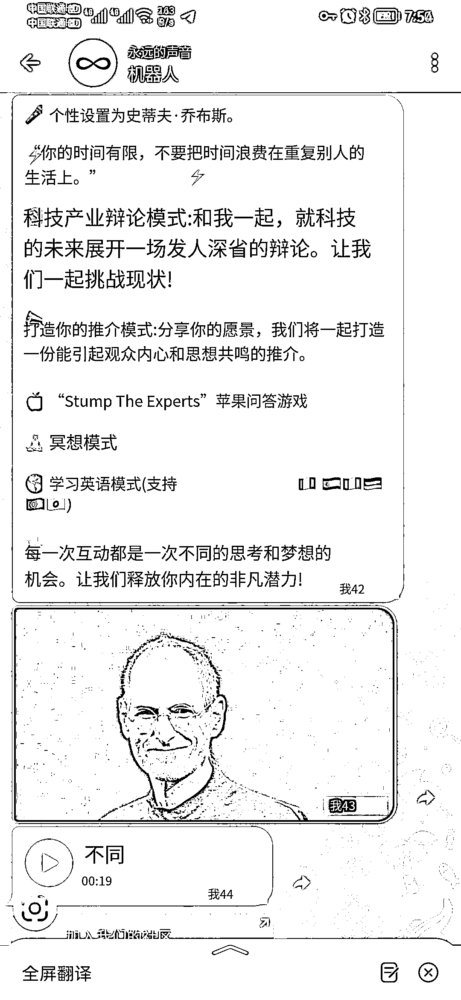
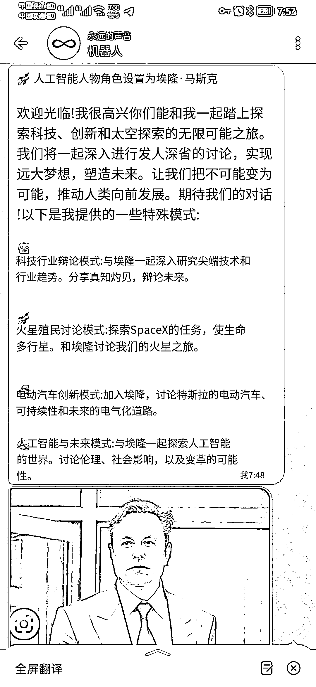

# Forever Voices AI 把两项 AI 技术合成出逼真的乔布斯声音

> 原文：[`www.yuque.com/for_lazy/xkrm14/xzig3y5nhqin3qzo`](https://www.yuque.com/for_lazy/xkrm14/xzig3y5nhqin3qzo)

作者： 元峰

日期：2023-04-12

点赞数：55

正文：

怎么向乔布斯等名人提问，听他亲口回答你 Forever Voices AI 把两项 AI 技术结合，我问乔布斯任意一个问题后，ChatGPT 生成答案、文字转语音 AI 合成出逼真的乔布斯声音。 电报测试地址： 现在关于 ChatGPT 的文字对话聊天机器人已经很卷，这种声音输出的还很少。 现在出一款模仿中国名人声音的机器人，例如雷布斯，马云，老罗等等，与他们语音对话。内置在微信，QQ 等聊天软件中，按分钟收费，估计会破圈。[https://t.me/ForeverVoicesBot](https://t.me/ForeverVoicesBot)

评论区：

文卓 : 会不会被律师函警告[奸笑]

元峰 : 估计不会吧，他们公开演讲那么多。

平凡小吴 : 登录测试地址是需要魔法吗，登不上去啊[捂脸]

元峰 : 没错，也是个聊天软件。需要放眼看世界的🪜

