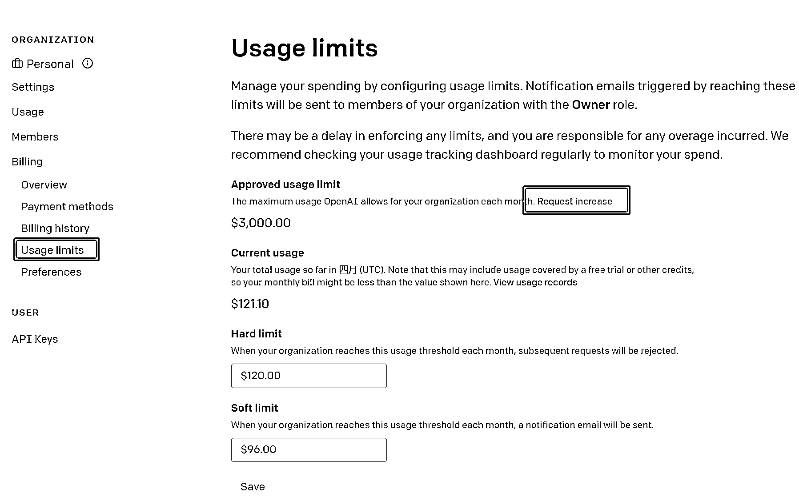
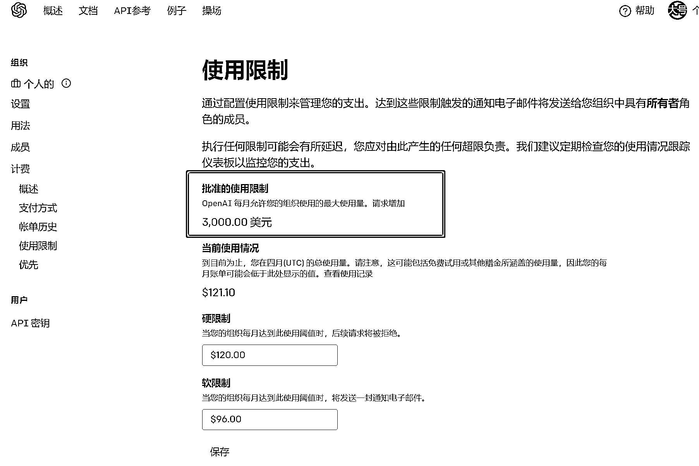
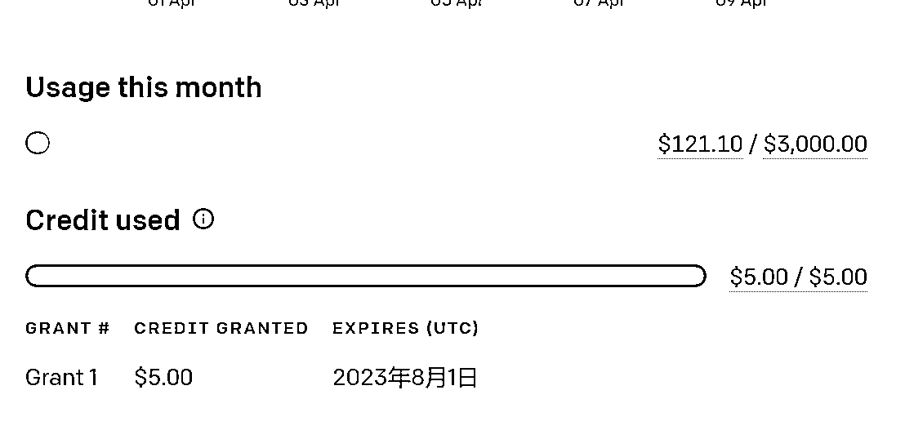

# 给 ChatGPT 账户提额到 3000 刀的方法

> 原文：[`www.yuque.com/for_lazy/xkrm14/bhrlcf3qmr6bwnd3`](https://www.yuque.com/for_lazy/xkrm14/bhrlcf3qmr6bwnd3)

作者： 强子

日期：2023-04-10

点赞数：25

正文：

如何给 ChatGPT 账户提额到 3000 刀，马上去查看你账户操作起来 今天以外发现马上实测提交了申请到 3000 额度，提交后不到半小时就通过了。 是这样的，之前买了一个 120 刀额度的账号（成本小几十块），120 刀额度早已消耗完了，今天鬼使神差登录了下意外发现额度限额里面显示上限允许到 3000，马上就点了提交申请，就填写了下必填项，很快就收到了通过审核的邮件。 白嫖 3000 刀能让我开心两三天了哈哈。 个人总结下最大可能的原因： 1、使用了企业邮箱注册（自定义域名邮箱注册账号）； 2、短时间内消耗量比较好，比如 24h 或 48h 消耗几十上百刀这种量。（之前给网站跑文章，一个 120 的号基本也就两天消耗完） 仅供参考，能确定一点的是，只要账户后台 Usage limits ---- Approved usagelimit 这里显示超过 120 比如 3000 的，点提交基本就能过审核，然后到硬限制 Hard limit 里面去改成上限额度即可。 openai

评论区：

亦仁 : 中标，术值 +1。 点击最上方 #中标 专栏，可查看所有中标风向标。

