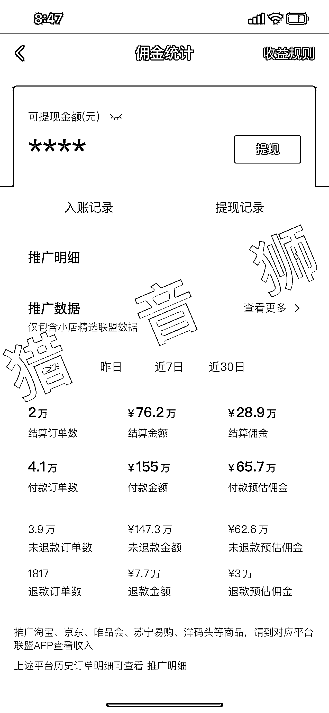

# 抖音陪读妈妈，陪读爸爸教辅带货赛道，月入 65.7 W

> 原文：[`www.yuque.com/for_lazy/xkrm14/nohgqtf7a4bzen51`](https://www.yuque.com/for_lazy/xkrm14/nohgqtf7a4bzen51)

作者： 猎音狮

日期：2023-04-13

点赞数：81

正文：

【抖音项目】月入 65.7 w! 陪读妈妈，陪读爸爸教辅带货! 这个赛道，想必圈友们都刷到过，不是很起眼，甚至有些视频点赞个位数，但是每天坚持发视频做的人，早就尝到甜头了。 这种视频拍摄很简单，要么是宝爸宝妈拿着手机在家自拍，要么就是孩子在写作业的时候，大人在旁边随手拍一些视频素材，然后挂上图书教辅类的商品，发布到抖音，每天发几条，碰到流量好的就投一点随心推，一个月下来卖个几百几千单不难。 这类商品佣金都比较高，很多都是 50`%五，就算一单赚十块钱，你算算一个月赚多少？这个赛道目前真的很香，还不是很卷！在家带娃的宝妈宝爸可以试试！ 如截图，这是我一个朋友的号，宝妈，孩子优秀，拍视频很配合，一个人，没团队，不过这收入是她去年的，今年一个月也有 10w➕ 我是猎音狮，点关注，不迷路，带你要转图书带货！让我们一起生财有术[耶][耶]

评论区：

财女小马达 : 耳目一新，灵光一闪，谢谢分享，这个项目看起来不错

猎音狮 : [机智][机智][机智]

witon : 育儿这个赛道不卷嘛

多闻 : 抖音现在各个赛道都很卷，这个数据投放也不会少的，现在自然流太少了

白奇杉 : 视频号发现了好多，我就是找不到一个可用的学生。

四叶草 : 请问投流吗，多吗

猎音狮 : 这是去年的，没投

四叶草 : 今年尤其难做，投千川也不好起来

