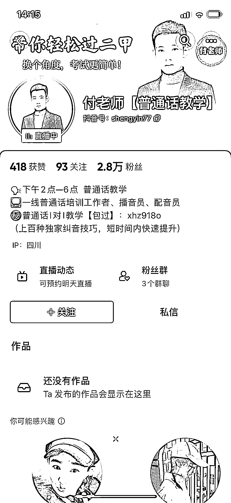

# 抖音普通话测试真题直播间，引流卖各种课

> 原文：[`www.yuque.com/for_lazy/xkrm14/zmutuws0nid0s8ab`](https://www.yuque.com/for_lazy/xkrm14/zmutuws0nid0s8ab)

作者： 时代

日期：2023-04-10

点赞数：14

正文：

抖音直播间 普通话测试真题 直播间在线练习，评估等级 直播间在线 3000+，排队 200+ 音浪+粉丝灯牌 收入，简介处留 V 引流私域，做培训 卖课 卖资料 私教课收入 找字正腔圆的主播（主持人）合作， 普通话一乙以上，可以直播间在线点评。 不知道有没有这类智能软件可以自动评估的，可以实现批量化操作。

评论区：

小李老师 : 虽然我不是主持人，但是是湖南省普通话测试员

时代 : 啊哈哈哈，我只是举个例子，普通话测试员才是专业[捂脸]

豆豆 : 对口

亦仁 : 中标，术值 +1。 点击最上方 #中标 专栏，可查看所有中标风向标。

