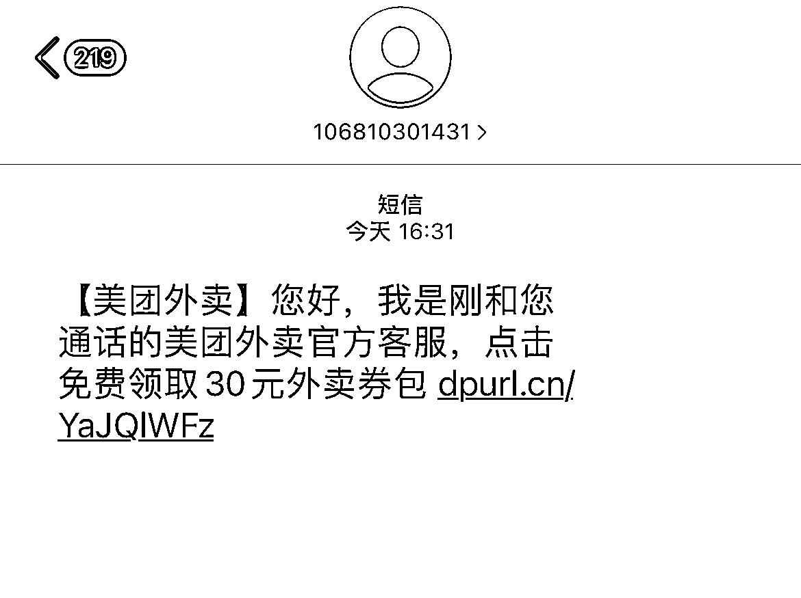
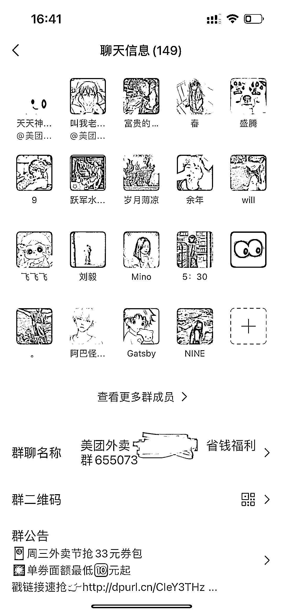

# 分享营销电话如何引流到私域

> 原文：[`www.yuque.com/for_lazy/xkrm14/henyt9i27y2il3kr`](https://www.yuque.com/for_lazy/xkrm14/henyt9i27y2il3kr)

作者： 寻兵

日期：2023-04-14

点赞数：61

正文：

营销电话，机器人话术是：问晚饭怎么解决，大额优惠券要不要，发送短信看一下进群领取，跟着流程进了群，发现群是根据地理位置拉的

评论区：

小钱学长 : 这是有黑基站？

Yang_ : 不是，是网址获取的位置信息

悟参 : 在微信美团小程序上能直接进入土（图 3）界面，进群后有几个机器人一直在发领卷链接。优惠劵是真实的，应该不是官方行为，问题是怎么能在小程序里植入跳转链接

欧欧 : 这为啥不是官方福利？

王学长 : 微信群里发的券是真的，且比 app 里发的大。我每次点外卖，都在群里领券

亦仁 : 中标，术值 +1。 点击最上方 #中标 专栏，可查看所有中标风向标。

黄海 : 这个非常牛逼，有资源的联系我[得意]一起飞

