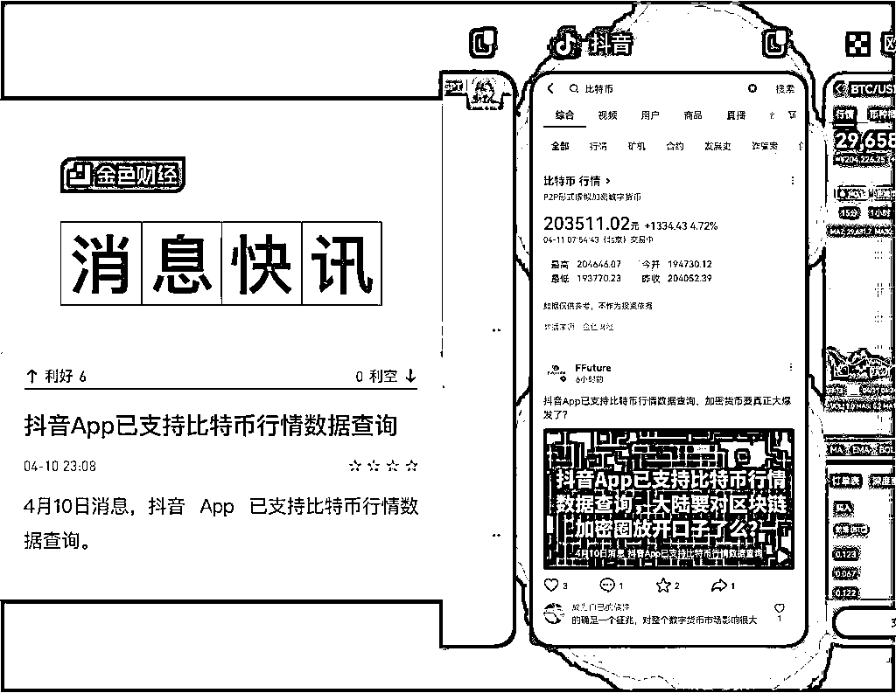
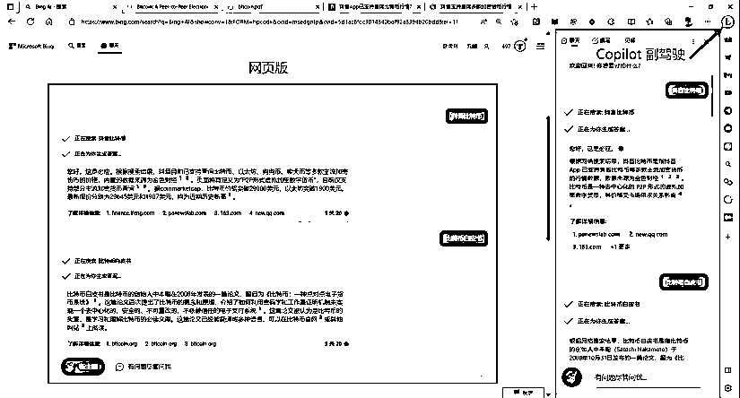
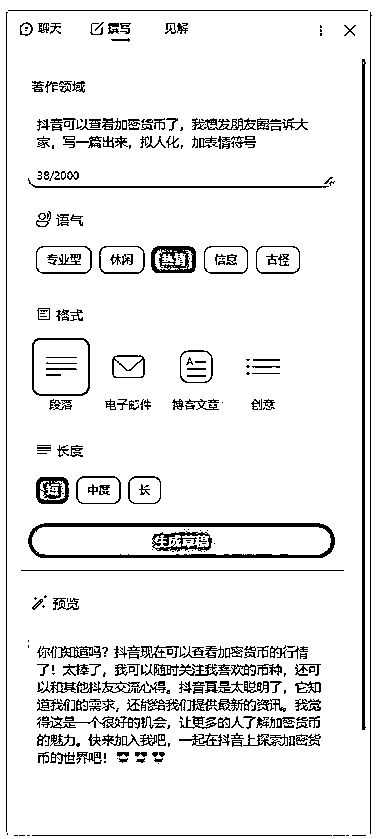
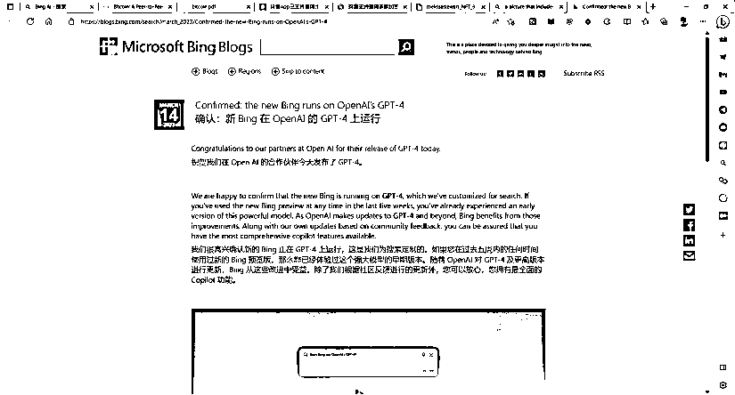

# 查询大饼价格信息的方法

> 原文：[`www.yuque.com/for_lazy/xkrm14/bsyb2qs67shtklhg`](https://www.yuque.com/for_lazy/xkrm14/bsyb2qs67shtklhg)

作者： 元峰

日期：2023-04-11

点赞数：23

正文：

今天早上，抖音上可以查询大饼价格的信息在不停地刷屏，这引起了我的兴趣。我便去 Bing 查询了一下，毕竟 Bing 集成 GPT-4 运行，而且是微软为搜索定制的。 然后，顺便让 Bing Copilot 副驾驶读一下大饼白皮书文档，画了张图，写段朋友圈文案，公众号文章。 完整步骤移步飞书：‌⁣‬⁡⁣‌⁢‬⁢‌⁡‌⁢⁤‍⁤⁤‌‌‬⁡‌⁤‍‌⁡‬⁡‌⁡‍[https://esouqpttmy.feishu.cn/docx/TakNdGYnQoi5FAxC...](https://esouqpttmy.feishu.cn/docx/TakNdGYnQoi5FAxCqeUckLEHnle)

评论区：

