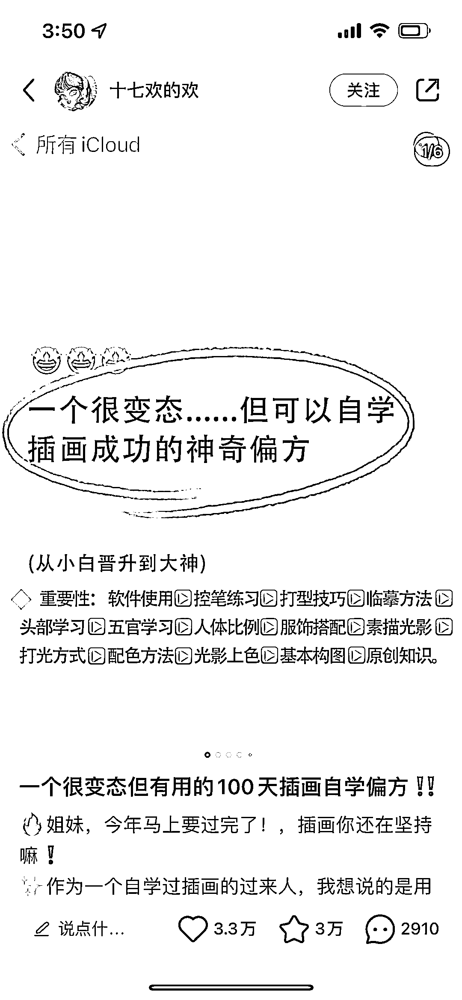

# 小红书爆款选题：一个很变态...但可以...的神奇偏方

> 原文：[`www.yuque.com/for_lazy/xkrm14/dt0rlxyms8ca3v3m`](https://www.yuque.com/for_lazy/xkrm14/dt0rlxyms8ca3v3m)

作者： 星月

日期：2023-04-14

点赞数：131

正文：

分享一个小红书爆款选题 各行业通用 效果绝了 已经在各行业看到无数次了 一个很变态...但可以...的神奇偏方

评论区：

生命大海狂野冲浪者 : 啊哈哈哈哈

向善而上～娜娜 : 一个快速赚钱的偏方～加入生财

金泽 : 我用这个公式爆过好几条笔记，“一个很变态但可以让男人很上头的方法。”“一个很变态但可以拿捏男人的方法~”

星月 : 优秀

思蒙 : 人性拿捏的稳稳的😄

兰心 : 抖音很多知识博主第一句：告诉你一个很恶心，但能快速起号的方法[呲牙]

💪🏻吉吉积极向上 : 这个好！

六妹 : 哈哈哈哈，分享一个“很变态”，但是能中风向标的神奇办法，点关注，我来告诉你~

