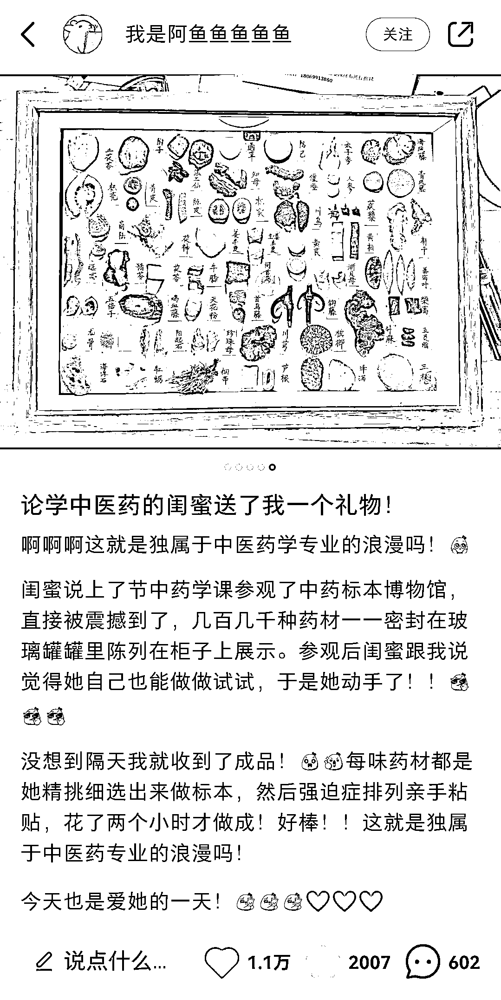

# 小红书一个万能句式+垂直标本的引流卖货的玩法

> 原文：[`www.yuque.com/for_lazy/xkrm14/qiv8956phzg9vpz9`](https://www.yuque.com/for_lazy/xkrm14/qiv8956phzg9vpz9)

作者： 愚洽

日期：2023-04-14

点赞数：77

正文：

小红书一个万能句式+垂直标本的引流卖货的玩法 “我有一个 xxxxxxx 好闺蜜/好女友/好男友/好老公/好老婆…送了…礼物”这个万能标题可以花式运用 垂直赛道的礼物可以是：中医的药材、化学的试剂、玩偶的零部件等等，一切都可以收集的都可以用来做成汇总标本，来卖货。甚至这个可以纯粹自制，成本低

评论区：

摸鱼掌柜 : 还有个句式： 去驿站拿了快递，被追问了一路哪买的 买了个 xxx，同事(室友)都追着我要链接 ....

思蒙 : 牛逼

Vicent : 这个很不错耶 谢谢分享

六妹 : 你们怎么如此优秀！！！

亦仁 : 中标，术值 +1。 点击最上方 #中标 专栏，可查看所有中标风向标。

魏易 : 丢给 GPT，又是十条句式

