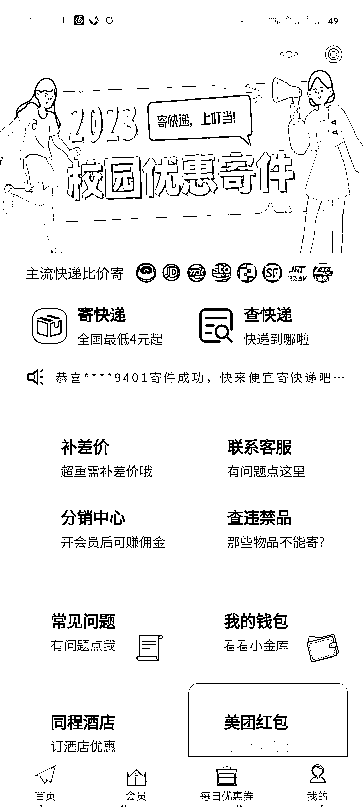

# 低价快递 cps 用咸鱼，小红书和抖音引流私域产生长期收益

> 原文：[`www.yuque.com/for_lazy/xkrm14/qvxrtddq25gb1wl9`](https://www.yuque.com/for_lazy/xkrm14/qvxrtddq25gb1wl9)

作者： 安慕希姓安（千校大学*

日期：2023-04-11

点赞数：25

正文：

低价快递 cps 是正常市场价发百分之 60 差不多 问了几个朋友 利润还有售价的百分之二三十左右 结合小程序接入公众号 用咸鱼，小红书和抖音引流私域 承接成为长期客户 产生长期利益

评论区：

秋闯 : 云洋等，这个怎么接入小程序

huii : 可以接入 APP 吗

安慕希姓安（千校大学* : 如果有圈友做这类平台的 可以聊聊 正好结合我这边校园资源公众号矩阵接入 互利[得意]

安慕希姓安（千校大学* : 这个就是小程序

安慕希姓安（千校大学* : 可以接入公众号

秋闯 : 同

安慕希姓安（千校大学* : 肯定可以啊，我或许没这个技术， 但我相信生财圈友肯定有懂得

huii : 你有大学资源吗 求合作

