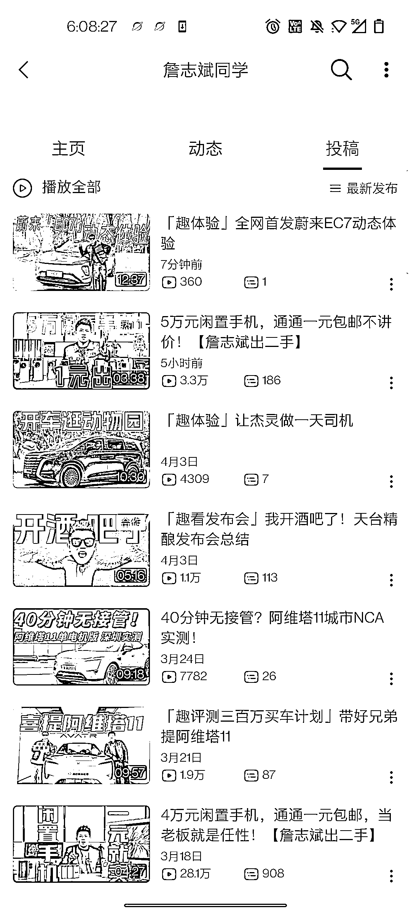
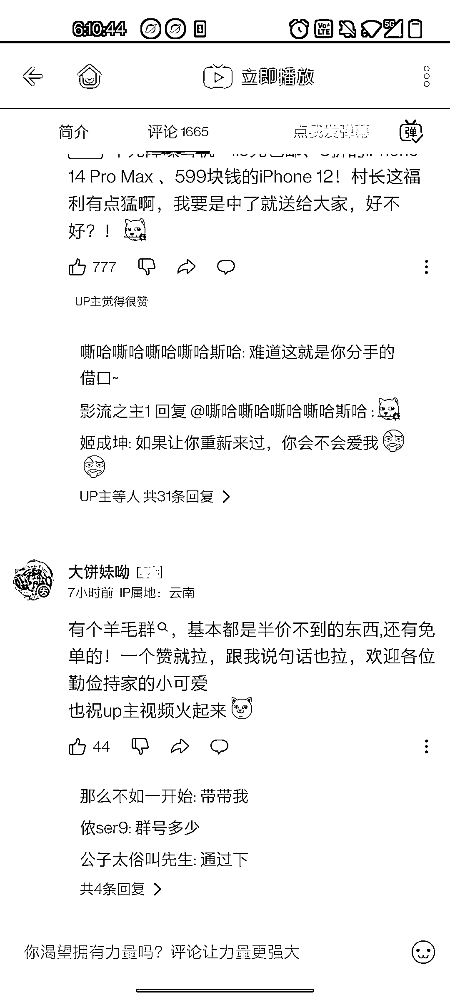

# B 站数码区的流量密码运用到其他领域，涨粉和引流都不错

> 原文：[`www.yuque.com/for_lazy/xkrm14/lvehupu5ovn1lksk`](https://www.yuque.com/for_lazy/xkrm14/lvehupu5ovn1lksk)

作者： 万青

日期：2023-04-11

点赞数：19

正文：

近一个月 b 站数码区的流量密码与涨粉秘籍 “出闲置” “闲置手机”等标题 p1 追溯闲置选题来源应是 lks p2 数码区最早该爆款选题数据非常好来自 p3 部分数码区 up 用该选题数据情况 p4-p7 评论区还能看见做截流和引流动作的 p8 偷懒没用工具查询各大博主涨粉数据 以其中一个博主举例 1、活动奖品原总价值￥49809，统一按 6 折清仓处理￥29885，预计回收价格￥10164——真情实意感恩回馈￥-19721； 2、粉丝行情价 0.5￥/个，计划增粉 39442 个方可回收成本； 3、转化方式①关注 B+播放量，②微信扫码问卷系统，③中奖后@B；④闲鱼曝光（若有） 可以得出这就是当下 b 站数码区的流量密码 迁移：运用到其他领域，什么母婴闲置都能达到一个不错涨粉和引流效果

评论区：

公众号懒人找资源，懒人专属群分享

