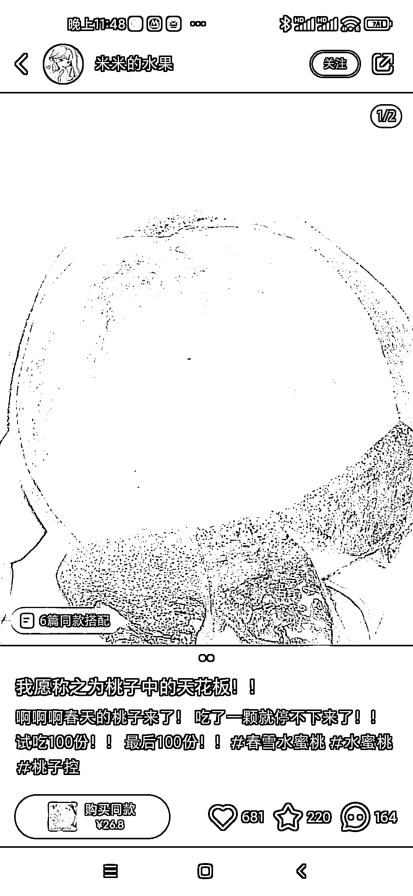
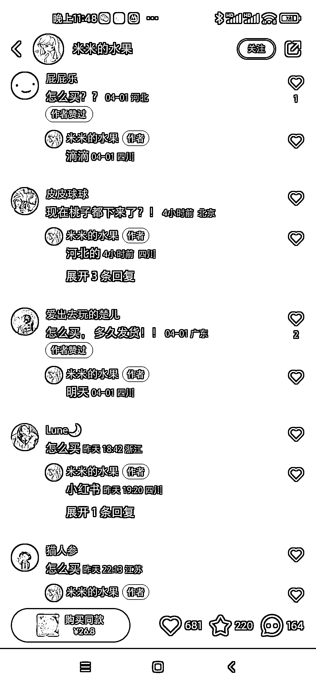
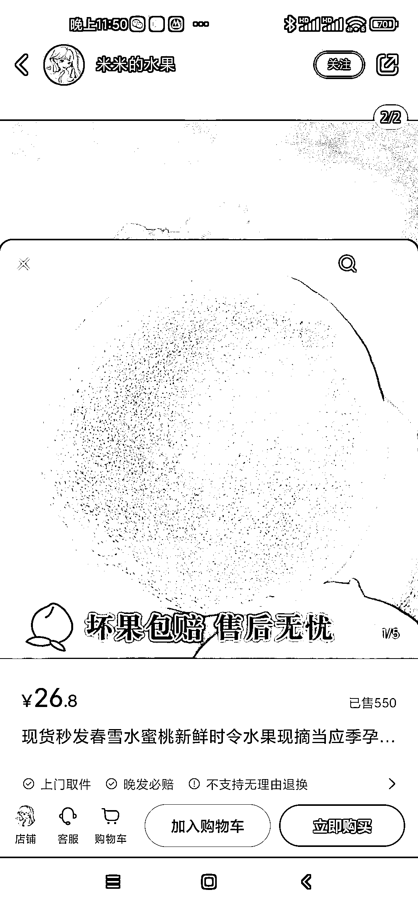
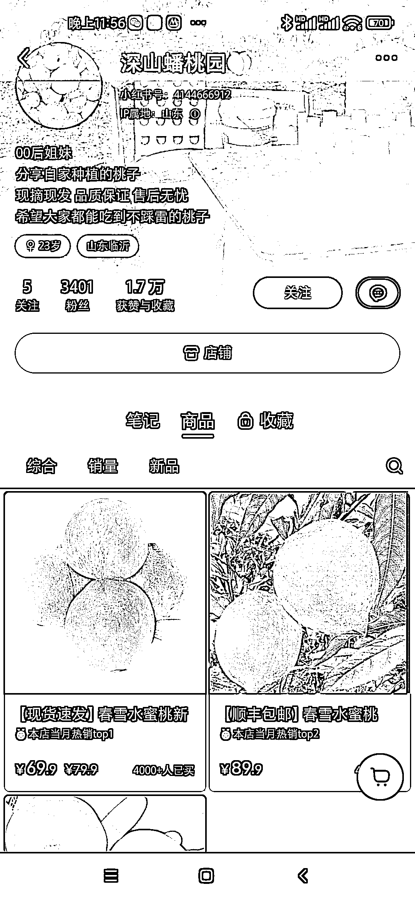

# 小红书平台 【水果】品类大蓝海， 一篇笔记爆销 500 单

> 原文：[`www.yuque.com/for_lazy/xkrm14/nqht07g3f315l6a9`](https://www.yuque.com/for_lazy/xkrm14/nqht07g3f315l6a9)

作者： 老孙说经济

日期：2023-04-10

点赞数：52

正文：

小红书平台 【水果】品类【大蓝海】 一篇笔记爆销 500 单！(图三） 蟠桃园人设 3000 粉丝卖出 4000 单.变现 30 万(图四） 图文内容简单，封面为诱人的水果，2 张图即可 (图一） 建议直接立人设，发图文笔记，或者实拍水果产地！！置顶一条人设的图文！！ 也可以结合之前盗坤的同城水果直播，专注做小红书的同城水果号，引导私域，有复购，是可以长期做的生意！

评论区：

lydia : 流量是很猛，生鲜类的，售后是不是很可怕

生命大海狂野冲浪者 : 有点吓人

