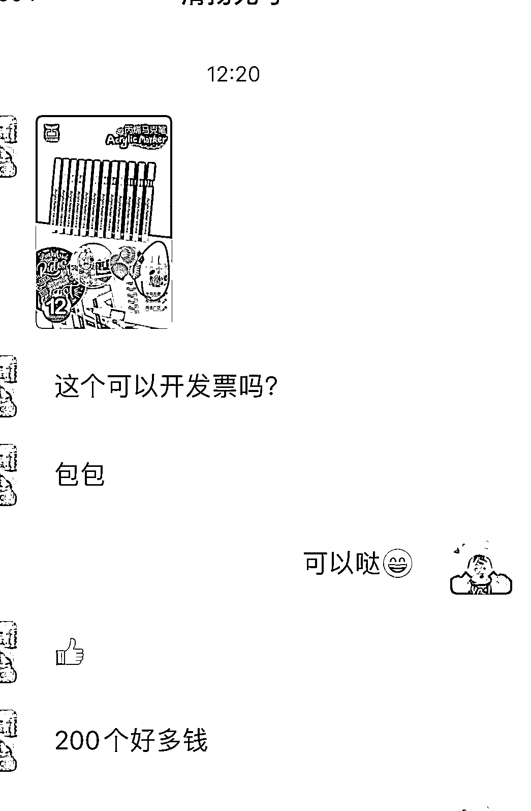

# 做快团团可以尝试对接小型的 B 端

> 原文：[`www.yuque.com/for_lazy/xkrm14/acpw9sq93vd38gzp`](https://www.yuque.com/for_lazy/xkrm14/acpw9sq93vd38gzp)

作者： 韩丹

日期：2023-04-10

点赞数：30

正文：

今天一个 100 人的群，通过快团团卖了快 1000，是因为有个艺术机构采购的买了个大单。200 个袋子³.5 的客单，虽然赚的不多。 但有个思路:做快团团可以尝试对接小型的 B 端，如果我们的供应链比较垂直或者还可以的话。

评论区：

十八 : 100 人的群每天销售额多少钱

韩丹 : 我目前主要卖的日用品 大概 300-500 之间

十八 : 那也就是说一天利润在 50 左右

韩丹 : 差不多，一个群一月的利润在 2000 左右

十八 : 那产值不错呀，这些粉的来源是哪里呢，粘性怎么样才能达到这个产值呢

韩丹 : 我们目前是测试群，大多是人都是我们以前做儿童兴趣课培训的家长。

十八 : 那你可以考虑放大人群看看，搞 10 个群呢

韩丹 : 嗯嗯，现在就在做这个事。也挺难，加油💪

