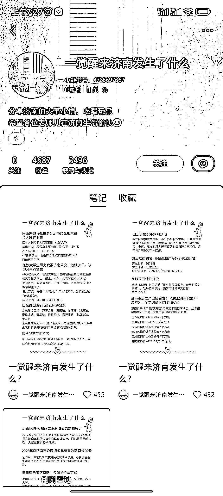

# 小红书账号按地域思路，三条笔记涨粉 4 千多

> 原文：[`www.yuque.com/for_lazy/xkrm14/pn9g21vt88m9ngzb`](https://www.yuque.com/for_lazy/xkrm14/pn9g21vt88m9ngzb)

作者： Mr.Zhang

日期：2023-04-10

点赞数：39

正文：

小红书账号 一觉醒来济南发生了什么 发布了三条笔记收获 4 千多粉丝

  

  

评论区：

lydia : 这个按地域的思路可以哦

lydia : 就是不知道咋变现

Vily 小维 : 同问

某人周 : 粉丝大多是本地人了，小红书建群后可以导流到微信私域。后续可以成交本地生活类产品，如果自己没有产品可以从吃喝玩乐等方面入手找能承接的本地商家。

费曼同学 : 想问一下这种信息整理，主要是看对标还是看自己的定位内容输出方向？

仗剑走天涯 : 信息源怎么找?

Fish 大鱼 : 我也想问

亦仁 : 中标，术值 +1。 点击最上方 #中标 专栏，可查看所有中标风向标。

