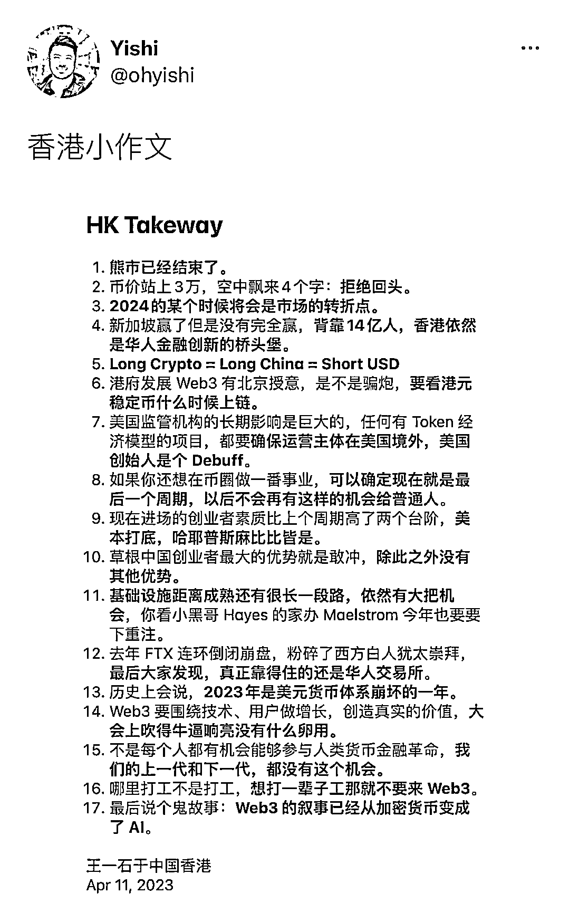

# Web3 是未来十年里我们能触摸最有趣的机会之一

> 原文：[`www.yuque.com/for_lazy/xkrm14/ipg3s1tmvmf6nobs`](https://www.yuque.com/for_lazy/xkrm14/ipg3s1tmvmf6nobs)

作者： 张潇雨

日期：2023-04-11

点赞数：56

正文：

最近众多圈内朋友都在香港开各种 Web3 大会，应该会见到各种风格的小作文。转发一个我的朋友 OneKey 创始人王一石老板的版本。对于里面的大部分观点，我自己都是一种谨慎同意的态度，说谨慎主要是很多细节，以我的能力还预测不到。但有一点是确定的，无论曾有多少人唱衰、或者行业经历了怎样的低谷，Web3 都没有死，而且以后也很难很难死了。这里虽然凶险与未知，但仍然是未来十年里你我这样的普通人能触摸到的最有趣的机会之一。

评论区：

金木 : 自从去年新加坡“token2049”之后，每个华人圈的会，都会有一堆这样的便签小作文😂

