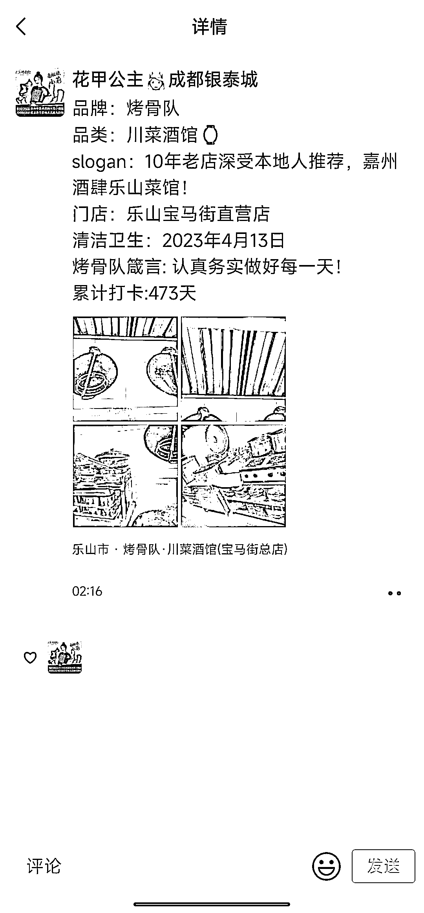
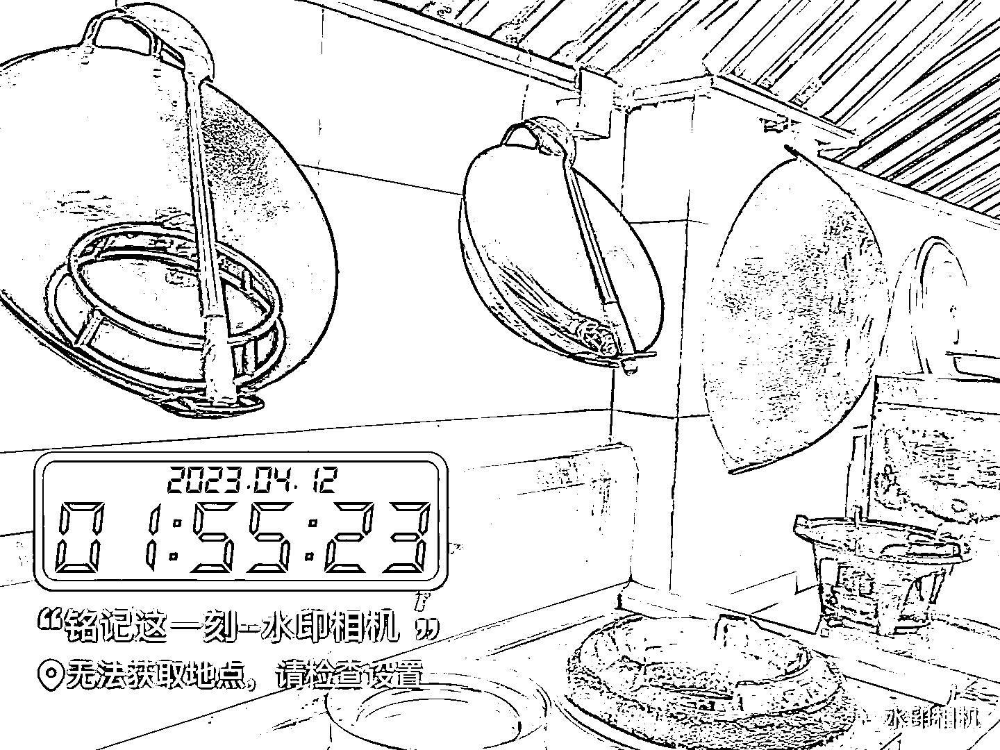
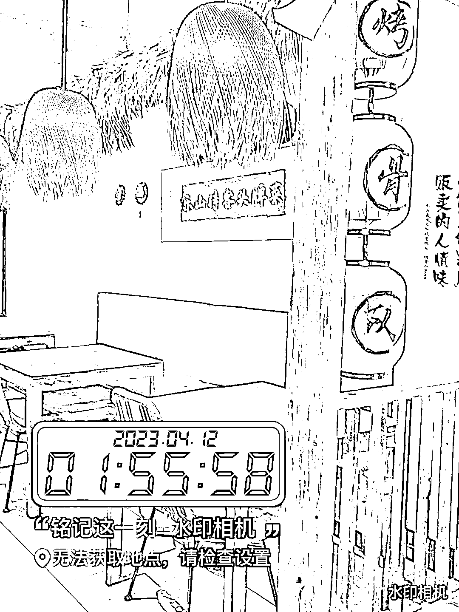

# 一个非常棒的做餐饮私域的方法，发当天的清洁打卡

> 原文：[`www.yuque.com/for_lazy/xkrm14/mt2cb8ei9bgkcod4`](https://www.yuque.com/for_lazy/xkrm14/mt2cb8ei9bgkcod4)

作者： 念念无住

日期：2023-04-14

点赞数：125

正文：

分享一个非常棒的做餐饮私域的方法。 大前年，2019，公司附近开了一家专门吃辣卤花甲的店，加了店家的私域微信。之后这个号又换了几家店，但看得出来，都是同一个老板。 因为这个微信号有一个非常明显的特点，朋友圈除了菜品推荐、活动引流，每天凌晨闭店的时候，他们会发当天的清洁打卡（如图）。非常特别。 用大师兄的话来说，就是你跟别人不一样，你就赢了。 餐饮店，干净卫生是本分，但是把本分亮出来，每天坚持打卡，这就非常厉害了。 这个微信号大前年在成都开店，关店以后老板就去了乐山开店。图片中已经是老板在乐山开的第三家店了。据说有成都的游客去乐山旅游，非要领队带他们去这家店光顾生意。我猜也是加了微信，被种草的。 认真做事，让人看到，就不会饿死。

评论区：

糯米糕 : 钱大妈也是，每天闭店时，会发店内整量后的图片到群里和朋友圈

念念无住 : 看来有可能是学的钱大妈

念念无住 : 我记得大师兄之前讲案例的时候，举的是外卖餐盒的例子。一个有质感的餐盒，成本增加几毛钱，会帮你拉高很大一截印象分。对复购和转介绍影响也很大。

大辉 : 确实是一个思路

阿翔君 : 这个让我想起了，广东的《包道》，每天下班他们都会大张旗鼓的各种打扫，冲水，每个路过的人都可以看到他们很认真的清洗，让人产生这家店很爱干净的感觉，现在想想也是一种营销方式啊。

念念无住 : 有仪式感的做清洁，肯定会加印象分。我猜他们主要做回头客生意😄

阿翔君 : 是的~做回头客生意

💪🏻吉吉积极向上 : 其他卖吃的店是不是可以放一组产品数量对比图，早晨货架上摆满晚上卖空

