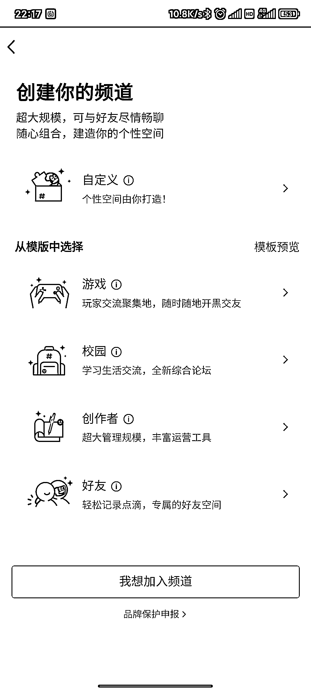

# QQ 可以在频道内直接搜索高校名称进入高校频道群

> 原文：[`www.yuque.com/for_lazy/xkrm14/hb2gsk9utmb0k13w`](https://www.yuque.com/for_lazy/xkrm14/hb2gsk9utmb0k13w)

作者： 上官

日期：2023-04-13

点赞数：81

正文：

QQ 新出的频道功能，可以在频道内直接搜索高校名称进入高校频道群。 我搜索了一下，发现有些高校没有建频道（查看了，官方号必须要官方认证）。 或许可以尝试找没有建立频道的在校生联系学校建立运营一个校园频道，能做的话，有管理的运营，整个学校的学生都是潜在资源。

评论区：

momo : 为啥搜的是南昌大学？莫非是……校友？[憨笑]

上官 : 哈哈 只是因为南昌大学名字最短了其实

小海 : 正在做校园外卖，这个可以尝试一下

Vicent : 这个超级 nice

上官 : 冲冲冲

上官 : 哈哈 冲冲冲

帮主 : 我们学校以前有个官方论坛，当时在校内很火，但是那一批管理的师兄师姐毕业后论坛就慢慢没落了。。

灯火 : 看到学校官方说不能打广告，有什么方式避免被踢出呢？

